# ax 동작 방식 & 사용자 프로세스 (v1.21.0)

> IP-AX 비즈니스실의 B2B/B2G 사업 생애주기 관리 에이전트.
> 어려운 산출물 체계·방법론은 **PM·PL·PP 에이전트가 흡수**하고, 사용자는 **물어보고 검토**만 한다.

---

## 1. 전체 아키텍처 — 5개 업무 스택

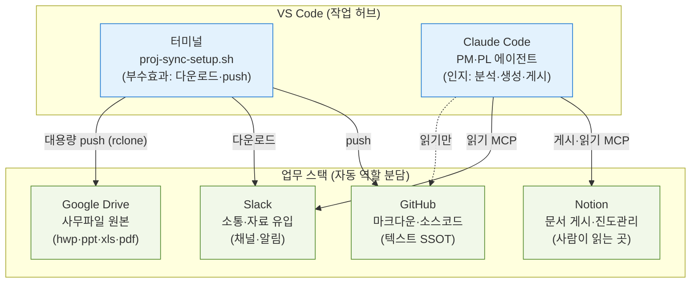

**핵심 원칙**: 터미널(부수효과)과 Claude Code(인지)는 **파일시스템으로만 핸드오프**한다. 직접 호출하지 않아 보안 분류기 차단을 구조적으로 회피한다.

---

## 2. 저장소 역할 분담 — 파일이 자동으로 나뉜다

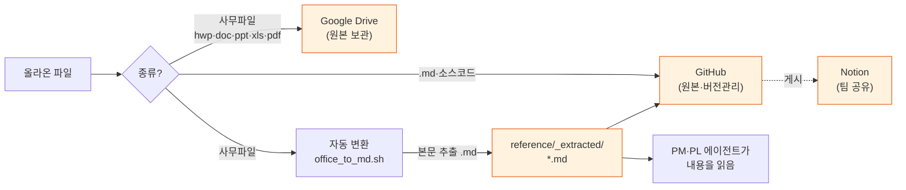

| 종류 | 저장소 | 비고 |
|------|--------|------|
| 마크다운(.md)·소스 | **GitHub** | 텍스트 SSOT |
| 문서 게시본 | **Notion** | 팀이 읽음 |
| 사무파일 원본 | **Google Drive** | GitHub 에 안 올림 (전송은 rclone) |
| 사무파일 본문 | **GitHub** (변환 .md) | PM·PL 이 읽게 |

### 게시본 생명주기 — 한 번 만든 문서는 없어지지 않는다 (v1.9.0)

○ **게시 대상은 config 가 정한다** — `notion.publish.globs` 로 모으고 `exclude_globs` 로 뺀다.
  대상 규칙이 없으면 동기화를 돌려도 **아무것도 올라가지 않는다**(15개 사업 439건 미반영의 원인).

○ **`출처경로`가 파일↔페이지의 유일한 확정 키** — `<project.id>/<repo 상대경로>`.
  제목으로 찾으면 「착수신고서」 같은 표준 산출물이 사업 간에 충돌해 **다른 사업 페이지를 덮어쓴다**.

○ **접두는 폴더명이 아니라 `project.id` 다 (v1.10.0)** — 폴더명을 쓰면 같은 파일이라도
  **게시한 사람이 어느 이름으로 클론했는지에 따라 키가 갈라진다**.

  ```
  ax-valid-patent-doc/reference/...   ← 레포명 그대로 클론한 머신에서 게시
  proj-delta/reference/...    ← 다른 머신
  ```

  이 때문에 31건이 문서함 조회에서 통째로 빠졌다(2026-08-03, 커버리지 100%→63%).
  `project.id` 는 registry 와 config 가 공유하는 값이라 머신에 좌우되지 않는다.
  기존 게시본은 `migrate_source_path.py` 로 일회성 마이그레이션한다 — **지우지 않고 프로퍼티만 바꾼다**.

| 경로 | 유형 | 상태 |
|---|---|---|
| `**/99_아카이브/**` | (기본값) | **아카이브** — 게시는 하되 표시. **프로젝트 태그 유지** |
| `reference/management/**` | **현황** | **현행화문서** — 살아있는 관리 문서 |
| `reference/management/reports/**` | — | `exclude_globs` 로 제외(시점 기록) |
| `reference/{drafts,management}/README.md` | — | `exclude_globs` 로 제외(init 스캐폴드 안내문 = 산출물 아님, v1.15.0) |
| 그 외 | `publish.type` | `publish.status` |

○ **정리는 삭제가 아니라 표시다** — 대상에서 빠진 게시본은 `publish-set` 종료 시 고아 스윕이
  `상태`=`아카이브`로 표시한다. 지우면 「무엇이 있었는지」를 잃는다.
○ `출처경로`가 **빈 페이지는 스윕 대상이 아니다** — 사람이 만든 그룹 페이지·`[Proj]` 루트를
  보호해 문서 계층이 평평해지지 않게 한다.

---

## 2-0. 협업 모델 — Slack 진입점 + 해시 멱등 (시차 없는 협업)

> **모든 파일은 Slack 채널로만 올린다(단일 진입점).** 에이전트가 읽어 로컬·Google Drive 로 저장하되, **rclone 체크섬(md5)** 이 같으면 Drive 에 다시 안 올린다(멱등). 언제 합류하든 모두 같은 기준을 본다.

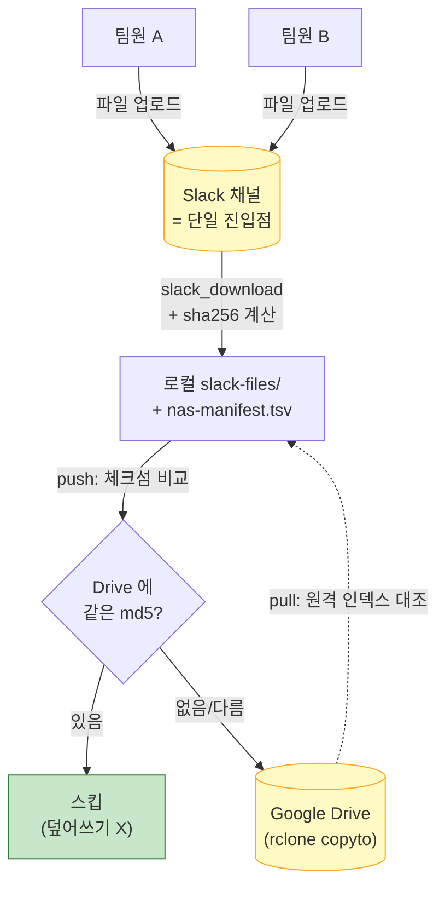

**시차 없는 협업이 성립하는 근거**:

| 메커니즘 | 효과 |
|----------|------|
| Slack 단일 진입점 | 파일 유입 일원화 — 누가 언제 봐도 같은 입력 |
| GitHub clone/pull | 문서(.md) 항상 최신 동일 (git 머지·충돌감지) |
| **rclone 체크섬 대조** | 모든 팀원이 **같은 md5 기준** → 중복 업로드 0 |
| **합류 시 git+Drive 동시 수신** | 기존 사업 합류(`(e)`) 시 GitHub 문서·소스(clone)와 Drive 사무파일(pull)을 **한 번에** 받아 완전한 시작 |
| **bash 3.2 호환(macOS 기본)** | 해시 멱등을 연관배열(`declare -A`, bash 4+) 없이 매니페스트 파일 직접 조회(awk)로 구현 → 팀원 PC에서 안 깨짐 |
| Notion 단일 DB | 사업상태·사업성격 단일 기준 |
| PM 최신성 점검 | "당신은 최신이 아님"(git behind·매니페스트 차이) 감지·안내 |

> **시차 한계(정직)**: '실시간 0 시차'는 아니다 — A가 push한 직후 B가 pull 안 하면 B는 이전 상태. git과 동일한 분산 협업의 본질. **PM이 "최신 아님"을 감지해 pull을 안내**해 실질 시차를 줄인다.

**Drive 사무파일 버전·충돌**:
- 버전 보존 = **Google Drive 버전 기록·휴지통**(Drive 기본 기능 — 보존 기간은 조직 설정에 따름, 검증 필요) + proj-sync `--backup`(덮어쓰기 전 `.bak-prev`).
- 동시 수정 = 해시 다르면 **push 전 충돌 경고** → 사용자 확인. 사무파일은 git처럼 병합 불가 → Snapshot 복원.

---

## 2-1. 산출물 표준 폴더 — 정부 단계 기준 (사용자는 폴더를 모름)

> 전자정부 **별표2 산출물 + 사업 단계**로 폴더가 결정된다. PL이 산출물 종류(stage)만 보고 **결정론적으로** 배치 → 사용자는 "어디 저장?"을 신경 쓰지 않는다.

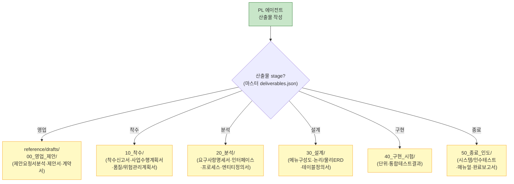

**4대 관리 문서** (산출물과 별도, 단계 무관):

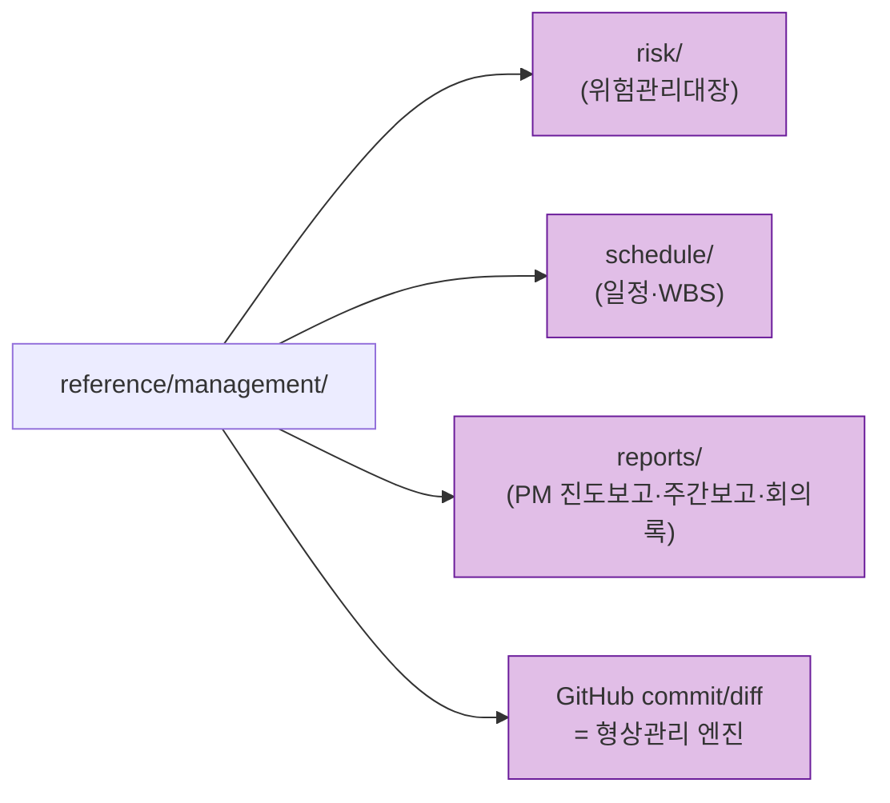

| 단계 폴더 | 정부 기준 산출물 |
|-----------|------------------|
| 00_영업_제안 | 제안요청서분석서·제안서·산출내역서·계약서 |
| 10_착수 | 착수신고서·사업수행계획서·품질보증/위험관리계획서·보안서약서 |
| 20_분석 | 요구사항명세서·인터페이스/프로세스/엔티티정의서 |
| 30_설계 | 메뉴구성도·논리/물리ERD·테이블목록/정의서·데이터코드목록 |
| 40_구현_시험 | 단위테스트·통합테스트 결과 |
| 50_종료_인도 | 시스템/인수테스트·매뉴얼·완료보고서·준공검사확인서 |

> 출처: 법제처 [별표2] 정보화사업관리 필수 사업산출물 (b2g 프로필 27개 = 영업4 + 별표2 23).

---

## 2-2. 사용자가 인식 못해도 PM이 챙긴다 (다중 프로젝트)

> 사용자는 여러 사업을 동시에 수행하므로 각 사업 상태를 기억하지 못한다. PM은 **호출될 때마다 현재 폴더의 근거(config·reference)를 새로 읽어** 그 사업 상태를 복원하고, 급한 것이 있으면 **묻지 않아도 먼저 알린다.**

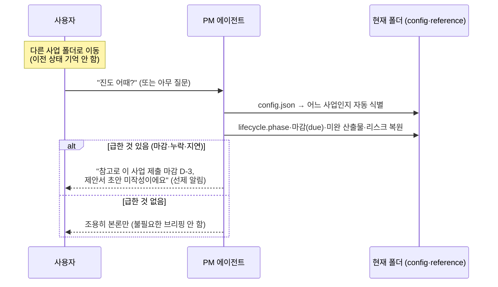

**핵심**: 사용자 기억에 의존하지 않는다. 상태는 **항상 파일에서** 복원되므로, 사업을 전환해도 그 폴더 기준으로 자동 전환된다.

---

## 2-3. revision 축 — 매일 commit-push 하는 버전관리 (v1.4)

> 프로젝트마다 `revision/`(history · WBS · 요구사항추적표)을 두고 **매일 한 일을 commit-push** 한다. 나중에 모든 프로젝트의 revision 을 모아 **교차 관리**(registry 연계)한다. **data(SSOT) → py 빌더 → md(리뷰) + xlsx(납품)**.

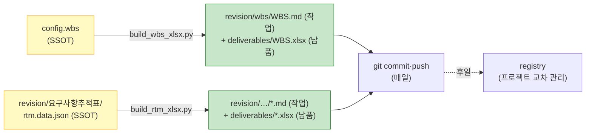

- **SSOT 는 데이터**: WBS = `config.wbs`(`tasks`·`base_date`·`meta`), RTM = `rtm.data.json`. md·xlsx 는 **파생물(손 수정 금지)** — `bash revision_build.sh`(=`/ax:revision`)로 재생성. 롤업(레벨1·2)·일정(주→날짜)·Gantt·요구사항 커버리지·충족도 집계는 leaf 에서 **결정론적 재계산**.
- **WBS 는 `config.wbs` 로 통합**: `manage-schedule`(진도·지연)과 `manage-revision`(문서 생성)이 **같은 데이터**를 다른 관점으로 읽는다. tasks 확장 스키마: `{wbs, level, name, phase, stage?, output, deliverable_keys[]?, req_id, rtm_req_id, arch, owner, start_w, end_w, effort, pred, due?, status}`.

**기존 전제와의 정합(의도적 분기)**:

| 지점 | 원 전제 | revision 정합 |
|------|---------|---------------|
| **A2 하이브리드 SSOT** (§2) | 사무파일(xlsx 포함)→Google Drive, GitHub=md·소스만 | WBS·RTM **xlsx 는 `deliverables/`(납품 Archive)에 git 추적**. 상세·정합은 §2-4. |
| **A5 결정론 폴더** (§2-1) | 산출물은 stage 로 `reference/drafts/00~50` | revision/ 은 별표2 stage 와 **별개의 top-level 버전관리 축**. 산출물 아카이브(deliverables/)와도 분리. |

## 2-4. deliverables 2분할 — 납품 Archive ⊥ 작업본 (v1.5)

> 산출물을 **작업본(초안·중간물)** 과 **납품본(고객 as-is 최종본)** 으로 분리한다.

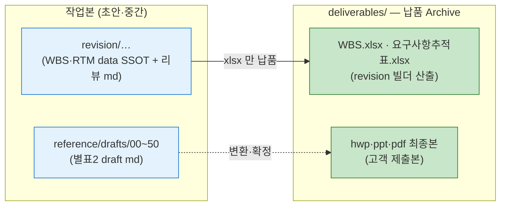

- **작업 ⊥ 납품 (경로 분리)**: revision 빌더가 `md → revision/`(작업·리뷰), `xlsx → deliverables/`(납품)로 나눠 출력. 별표2 초안은 `reference/drafts/`, 그 최종본이 `deliverables/`.
- **RTM/WBS 는 통째로 납품이 아니다**: data-SSOT(`config.wbs`/`rtm.data.json`)+`*.md` = **작업**, `*.xlsx` = **납품**. 파이프라인이 이미 이 선을 embodied.
- **Archive = 전부 로컬 git (A2 대폭 예외)**: `deliverables/` 안은 **사무파일 최종본(hwp·ppt·pdf)까지 git 추적**(`.gitignore` `!deliverables/**`). A2("사무파일→Drive")를 Archive 한정 대폭 예외. 레포 비대 위험은 감수(대용량 누적 시 "소형=git/대형=Drive" 재검토).
- **네이밍**: 최상위 `deliverables/`(납품) vs `reference/drafts/`(작업 초안, 구 `reference/deliverables/`) — 개명으로 충돌 해소.

## 3. 컴포넌트 구성

```mermaid
graph TD
    subgraph Plugin["ax 플러그인 (v1.21.0)"]
        subgraph Agents["에이전트 (Claude Code) — 3종"]
            PM["@agent-ax:pm<br/>사업관리 (read-only)"]
            PL["@agent-ax:pl<br/>문서작성 (Bash 제한)"]
            PP["@agent-ax:pp<br/>제안 파이프라인 (v1.8)"]
        end
        subgraph Skills["스킬 — 21종"]
            SK_M["PM 4대 관리<br/>deliverable·schedule<br/>risk·config"]
            SK_R["revision·report<br/>premise·minutes<br/>(v1.4~1.7)"]
            SK_P["게시·정리·감사<br/>notion-publish<br/>categorize-files<br/>audit-doc-tree (v1.9)"]
            SK_S["run-sync·inbox<br/>start-from-notion"]
            SK_X["제안축 6종 + dispatch<br/>rfp-extract·toc·strategy<br/>draft·evaluate·build-deck"]
        end
        subgraph Scripts["스크립트 (부수효과)"]
            S1["setup·doctor<br/>config_migrate (v1.16~17)"]
            S2["init·start·registry<br/>(scaffold.sh 공유)"]
            S3["slack_download·upload<br/>slack_inbox·slack_post"]
            S4["github_push<br/>(LFS·secret-scan)"]
            S5["gdrive_sync<br/>(File Station API)"]
            S6["office_to_md·parse_doc<br/>(변환)"]
            S7["build_{wbs,rtm,report,<br/>premise,minutes}<br/>(결정론 빌더)"]
            S8["docquark·build_deck<br/>evaluate_aggregate<br/>dispatch·hitl_scan"]
            S9["doc_audit·doc_tree<br/>doc_version"]
        end
        subgraph Data["기준 데이터 (SSOT)"]
            CFG["config.json<br/>(사업 설정·WBS·_init)"]
            MASTER["deliverables.json<br/>(표준 산출물 마스터)"]
            PROP["proposal/*.json<br/>(requirements·toc)"]
        end
    end

    PM --> CFG
    PM --> MASTER
    PM --> SK_M
    PM --> SK_R
    PL --> MASTER
    PP --> SK_X
    PP --> PROP
    SK_X --> S8
    SK_R --> S7
    S1 --> CFG
    S3 --> S6
    S6 --> EXT2["reference/_extracted/"]
    PM --> EXT2
    PL --> EXT2

    classDef ag fill:#e1bee7,stroke:#6a1b9a
    classDef sc fill:#bbdefb,stroke:#1565c0
    class PM,PL,PP ag
    class S1,S2,S3,S4,S5,S6,S7,S8,S9 sc
```

### 설치본 유지보수 — additive 마이그레이션 (v1.15~1.17)

> 개선이 **재init 없이** 기존 사업에 닿아야 한다. v1.15.0 까지는 닿지 않았고, 그래서 사용자 수 × 사업 수만큼 미적용이 남았다.

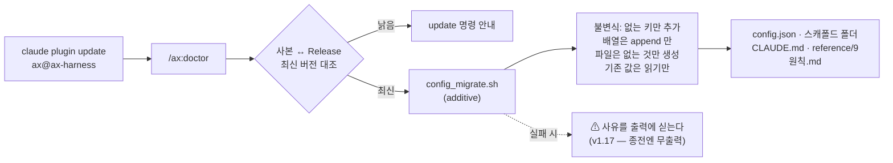

- **불변식이 곧 자동 실행의 안전 근거다.** 기존 값을 절대 덮어쓰지 않으므로 사용자 확인 없이 돌려도 된다. `--dry-run`·`PS_NO_MIGRATE=1` 제공.
- **`lib/scaffold.sh` 로 단일화** — `init.sh`(신규)와 `config_migrate.sh`(보강)가 같은 코드를 쓴다. 복붙하면 드리프트가 확정된다: v1.5.0 개명 후 init 스캐폴드가 빠져 **15개 사업 중 14개가 산출물 집계 0건**이었다(2026-08-02).
- **`config._init` 블록** — `{plugin_version, at, created_version, created_at}`. 종전 `"version": 1` 은 스키마 리터럴이라 어떤 버전이 만든 config 인지 사후에 알 방법이 없었다. v1.14.0 이하 생성분은 `unknown(<=1.14.0)` 로 이력 보존.
- **실패를 삼키지 않는다 (v1.17.0)** — 종전에는 스캐폴드가 실패해도 무출력이라 **받지 못한 것을 받았다고 믿는** 상태가 됐다. 이제 사유를 `⚠ 스캐폴드 실패(rc=N) — …` 로 doctor 출력에 싣는다. 「치명 아님(호출부를 막지 않음)」은 그대로다.
- **한계**: doctor 를 한 번도 돌리지 않는 사용자에게는 닿지 않는다. 「사본 ↔ 릴리즈 최신본 대조」가 부분적으로만 보완한다.

### 9원칙 — 모든 사업의 기본값 (v1.17.0)

> 원칙이 **개인 기억이 아니라 사업 저장소**에 있어야 한다. 전역 설정에 두면 clone 한 팀원 환경에는 그 파일이 없어 참조가 깨진다.

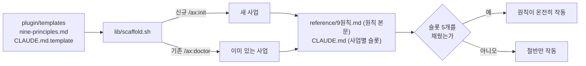

- **9원칙** = 정합성 · 무결성 · 구조성 · 리니지 · 논리성 · 유지보수 · 운영성 · 보안·규정 · 성능·효율.
- **위반 신호·확인 방법을 병기한 것이 핵심이다.** 사고는 원칙을 몰라서가 아니라 **「충족했다고 믿었는데 아니었던」** 형태로 일어난다 — 그래서 §2(측정)·§3(실패 가시화)·§4(완료의 정의)가 원칙 표만큼 중요하다.
- **사업별 슬롯**(1순위 정의·회귀 게이트·SSOT 위치·자원 격리·레슨 로그)은 루트 `CLAUDE.md` 가 채운다. 개인 전역 `~/.claude/CLAUDE.md` 와 충돌하면 **사업 `CLAUDE.md` 가 우선**한다 — 전역은 사람 단위 취향, 이쪽은 사업 단위 계약이다.
- **아키텍처 원칙(A/D/H)과 별개 축이다.** A/D/H = *이 도구를 어떻게 짜는가*, 9원칙 = *무엇을 만들든 어떻게 검증하는가*.
- **게시 대상이 아니다** — `publish.globs` 가 `reference/drafts/**`·`reference/management/**` 뿐이라 `reference/9원칙.md`·루트 `CLAUDE.md` 는 Notion 으로 올라가지 않는다.
- **한계(정직)**: 슬롯은 `_(미정)_` 으로 생성된다. `/ax:init` 이 1순위를 **묻지 않으므로**, 아무도 채우지 않으면 그대로 남는다(issue #25).

---

## 4. 생애주기 & 산출물 (2축 모델)

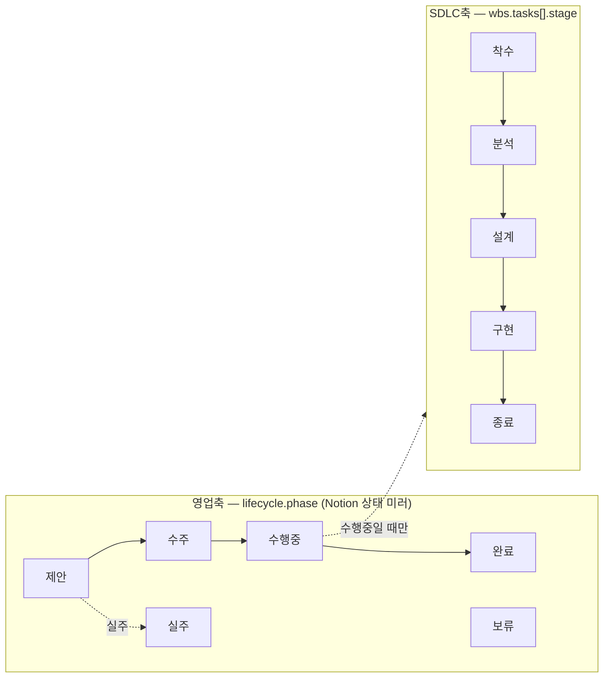

> **2축 분리**: 영업 단계(제안→완료)와 개발 단계(착수→종료)는 직교한다. "수행중" 안에서만 SDLC stage 가 의미를 가진다.

### V-Model 산출물 추적 (수행중 단계)

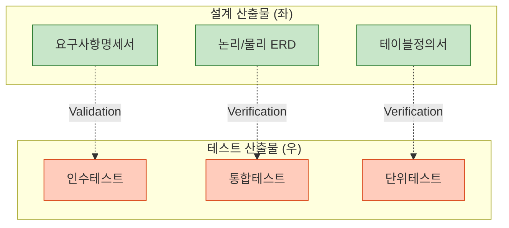

> PM 이 "설계는 완료인데 대응 테스트 미작성" 누락을 **마스터의 짝(verified_by/verifies)으로 결정론적 검출**한다.

---

## 5. 사용자 프로세스 — 전체 흐름

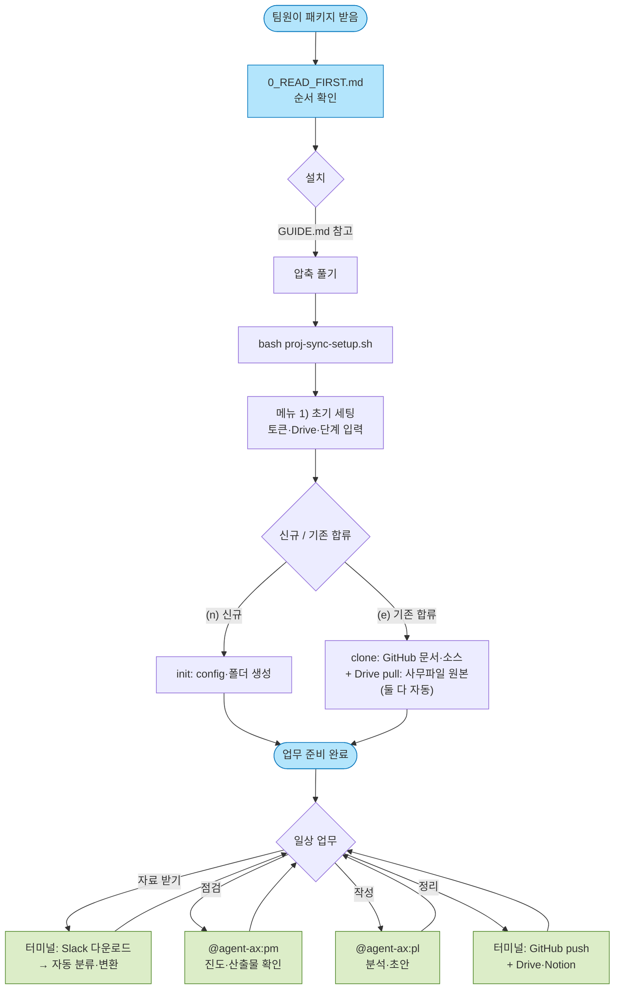

---

## 6. 자료 다운로드 → 변환 → 분석 (상세 흐름)

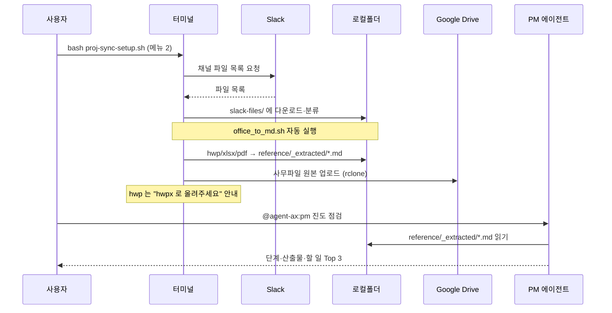

---

## 7. PM·PL 에이전트 협업 모델

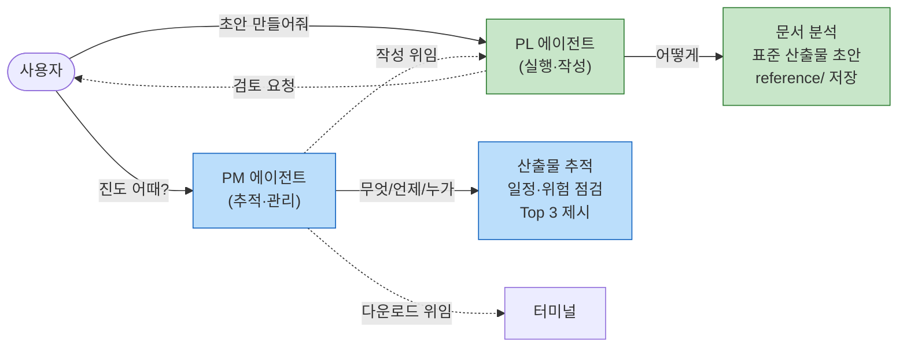

| 구분 | PM | PL |
|------|-----|-----|
| 역할 | 추적·관리 (무엇/언제/누가) | 실행·작성 (어떻게) |
| 권한 | 읽기 전용 (Bash 없음) | Bash 있음 (변환·작성) |
| 산출물 | 점검 보고 | 문서 초안 |

> 둘 다 **부수효과 스크립트(다운로드·push)는 직접 안 함** → 터미널에 위임. 보안 분류기 회피.

---

## 7-1. PM 오케스트레이터 — 4대 관리를 지휘

> 사용자는 **PM 하나만** 부른다. PM이 뒤에서 4대 관리 스킬을 호출·종합한다(복잡성 숨김). 각 관리는 **Agile + V-Model** 적용.

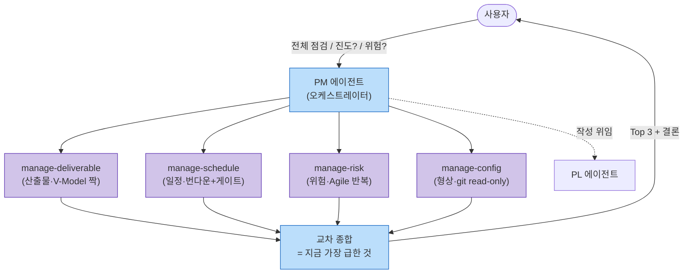

| 4대 관리 | 스킬 | 방법론 |
|----------|------|--------|
| 산출물 | manage-deliverable | V-Model 짝 추적성 + Agile 증분 |
| 일정·진도 | manage-schedule | Agile 번다운 + V-Model 단계 게이트 |
| 위험 | manage-risk | Agile 반복 점검 |
| 형상 | manage-config | GitHub commit/diff (read-only) |

> 모든 관리 스킬은 **read-only** → 분류기 회피. 작성은 PL, push는 터미널.

---

## 7-2. 공고 → 프로젝트 자동 생성 (Notion 기준)

> Notion 통합 DB에서 **'제안 진행' 결정 사업만** → 영문 폴더·config·공고요약 생성. **데이터 불일치는 PM이 잡아 확인**(사용자 무입력 보정).

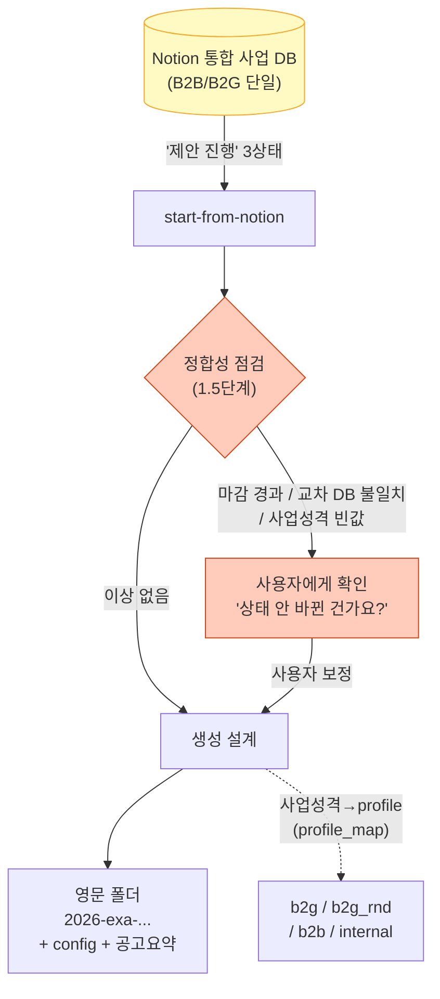

**사업성격 → profile 매핑** (`profile_map`):

| Notion 사업성격 | profile | 산출물 |
|-----------------|---------|--------|
| B2G-용역 | b2g | 별표2 27종 |
| B2G-과제 | b2g_rnd | R&D(연구계획·연차/단계보고·연구노트) |
| B2B | b2b | 축소 8종 |
| 내부과제 | internal | 최소 3종 |

> **핵심**: 사람이 노션 갱신을 빠뜨려도 PM이 불일치(마감 경과·교차 DB 모순)를 근거로 잡아 확인 → 잘못된 데이터로 생성하지 않는다.

---

## 7-3. 제안축 파이프라인 — RFP → 발표자료 (v1.8.0)

> **영업축(제안 phase) 전담.** `@agent-ax:pp` 가 6단계를 순차 구동한다. 각 단계는 **구조화 SSOT 를 남기고 다음 단계가 소비**한다(D2 준용) — 대화 맥락이 아니라 파일이 핸드오프 매체다.

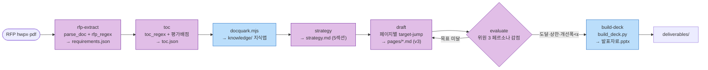

| 단계 | 스킬 | 입력 → SSOT 출력 | 유형 |
|---|---|---|---|
| 1 | `rfp-extract` | RFP(hwpx/pdf) → `proposal/requirements.json` | 인지 |
| 2 | `toc` | RFP 작성요령·평가배점 → `proposal/toc.json` (요구사항 매핑·R&R·배점) | 인지 |
| 3 | `strategy` | requirements → `proposal/strategy.md` (5섹션) | 인지 |
| 4 | `draft` | toc+req+전략+`knowledge/quark` → `proposal/pages/{id}.md` (v3 propdraft) | 인지 |
| 5 | `evaluate` | pages → 감점 집계 + 자동 개선 반복 | 인지 + 결정론 집계 |
| 6 | `build-deck` | pages → `proposal/build/발표자료.pptx` | **부수효과(스크립트)** |

- **A3 정합**: 1~5 는 에이전트(인지), 6 은 스크립트(부수효과). 파싱·docquark·pptx 빌드는 전부 스크립트 엔트리포인트로만 — 인라인 curl·토큰 직접취급 금지. **예외 하나(v1.21.0)**: Notion 게시는 로그인한 사용자 명의의 claude.ai 커넥터(MCP)가 한다 — 단 판정(대상·매칭·프로퍼티·고아)은 `notion_plan.sh` 가 계획 JSON 으로 내고 에이전트는 그 action 을 호출로 옮기기만 하므로 인지·부수효과 분리는 유지된다.
- **A5 정합**: 작업 산출은 `reference/drafts/00_영업_제안`, 납품 pptx 는 `deliverables/`.
- **RAG 를 쓰지 않는다** — 근거는 `docquark.mjs` 가 만든 `knowledge/` 지식맵에서 **target-jump** 로 가져온다. 임베딩·벡터DB 의존을 제거해 팀원 PC 에서 동일 구동(A6).
- **무한루프 방지**: `evaluate` 종료조건 = *목표점수 도달 OR 라운드 상한 N OR 개선폭 < ε*.
- **능동 HITL**: `hitl_scan.py` 또는 파이프라인 중 결정 필요 지점(미매핑 요구사항·평가규정 미확인·모호 담당)에서 **옵션형 질문** → 답을 SSOT 에 반영 후 재개. 자율 ≠ 맹목.
- **역할 경계**: PP = 제안 phase 전담. 수행 phase 관리(진도·위험·산출물)는 PM, 개별 산출물 초안은 PL. phase 전환·registry 는 PM.
- **런타임 전제**: Node.js 18+ · python-pptx · PyYAML · lxml — `/ax:doctor` §5.5 가 프리플라이트한다(A6 stdlib 원칙의 명시적 분기).
- **한계(정직)**: `evaluate` 점수는 **페르소나 기반 감점 시뮬레이션**이며 실제 평가위원 점수가 아니다. 파일 컨텍스트 직접주입 방식이라 자산이 대규모가 되면 스케일 한계가 있다(경량검색 도입 시점은 미확정).

---

## 8. 보안 경계 — 무엇이 어디서 실행되나

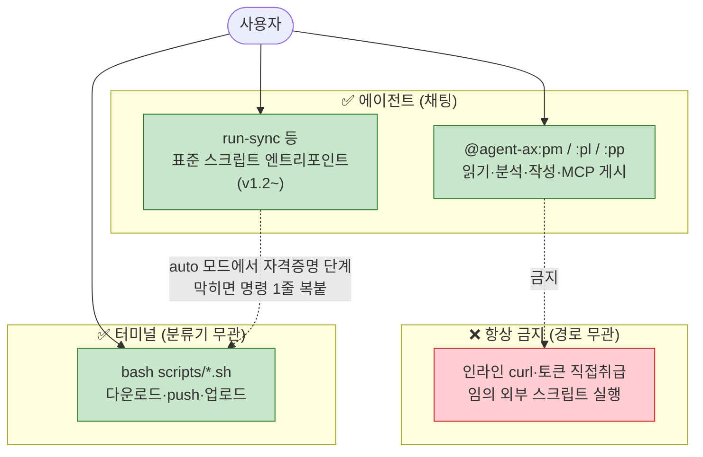

> **실무 규칙**: 분석·점검·작성 = **에이전트**(채팅). 부수효과(다운로드·push·업로드)는 **표준 스크립트 엔트리포인트로만** — v1.2 부터 에이전트도 그 엔트리포인트를 직접 호출할 수 있고(터미널 경로 병행), 토큰은 스크립트가 내부 해석하므로 에이전트는 토큰을 만지지 않는다. auto 모드에서 자격증명 단계가 막히는 것은 정상(사용자 위임).

---

## 9. 데이터 SSOT (단일 진실원천)

```mermaid
graph TD
    NOTIONDB["Notion 수행 프로젝트 DB<br/>(사업 마스터·상태)"]
    NOTIONDB -->|"registry-sync"| REG["GitHub registry.json<br/>(기계 미러)"]
    REG -->|"init/start 선택"| CONFIG["사업별 config.json<br/>(lifecycle·wbs·nas)"]
    CONFIG -->|"읽음"| PMPL["PM·PL 에이전트"]
    MASTER2["deliverables.json<br/>(표준 산출물·V-Model)"]-->|"읽음"| PMPL

    classDef ssot fill:#fff9c4,stroke:#f9a825
    class NOTIONDB,MASTER2 ssot
```

| 데이터 | SSOT |
|--------|------|
| 사업 마스터·상태 | **Notion 수행 프로젝트 DB** |
| 사업별 설정·WBS | **config.json** (사업 repo) |
| 표준 산출물 정의 | **deliverables.json** (플러그인 1곳) |
| 산출물 버전·변경 | **GitHub** (commit/diff) |

---

## 10. 한눈에 — 하루 업무 흐름

```mermaid
journey
    title proj-sync 하루 업무
    section 아침
      진도 점검 (@pm): 5: 사용자
      오늘 할 일 확인: 5: PM
    section 자료
      Slack 다운로드 (터미널): 4: 사용자
      자동 변환: 5: office_to_md
    section 분석·작성
      문서 분석 (@pl): 5: PL
      산출물 초안: 4: PL
      검토·수정: 3: 사용자
    section 정리
      GitHub push (터미널): 4: 사용자
      Drive·Notion 동기화: 5: 자동
```

---

## 부록 — 형식별 변환 지원

| 형식 | 변환 | 추출 단위 |
|------|------|-----------|
| hwpx | ✅ | 본문 + 표(마크다운) |
| hwp | ⚠️ → hwpx 안내 | (변환 보류) |
| xlsx | ✅ | 표 → 마크다운 |
| docx | ✅ | 문단 |
| pptx | ✅ | 슬라이드별 + 표 |
| pdf | ✅ | 본문 + 표 (pdfplumber) |

> 변환본 파일명은 영문(`01_F0BCGSCDZS6_hwp.md`), 원본 한글명은 .md 헤더에 보존.
