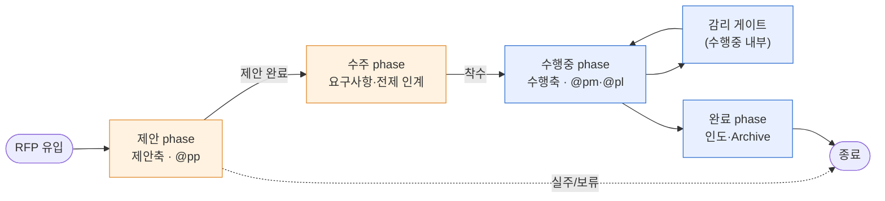
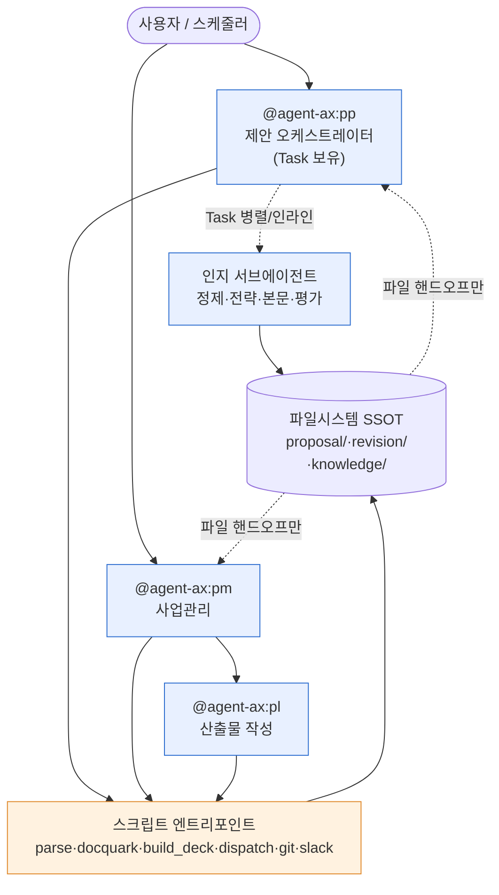
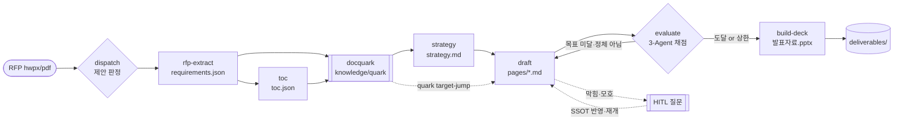
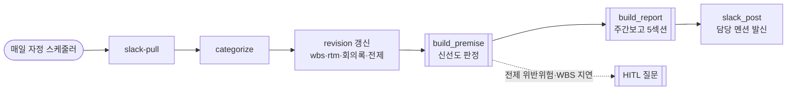

# ax 아키텍처 레퍼런스 (Architecture Reference)

> **proj-sync(제품명 ax) 에이전트 구조·설계 원칙·기능 카탈로그의 단일 상위 레퍼런스.**  
> 기준: ax **v1.8.0** (`hank-netpg/proj-sync-harness`). 갱신 2026-07-26.  
> 📊 정형 도식(시스템·컴포넌트·DFD·ERD·시퀀스·상태·Gantt) 10종은 [`docs/DIAGRAMS.md`](DIAGRAMS.md) 참조.
>
> 설계 결정의 근거(왜 이렇게 만들었나)는 이 문서에 요약하고, 상세 흔들기·이식 이력은 [`docs/design/`](design/)(DESIGN·SPEC·DETAIL·PROPOSAL_PIPELINE) 참조.

---

## 1. 개요 · 정체성

ax는 **사업 전 생애주기(제안 → 수주 → 수행 → 감리 → 완료)를 관통하는 사업관리·문서 자동화 도구**다. 팀원 수준이 다양하므로 **표준(폴더·양식·방법론)을 도구가 흡수**하고 사용자는 "무엇을 할지"만 다룬다.

### 1.1 2축 생애주기 (핵심 멘탈모델)
- **영업축**: 제안 → 수주 → 수행중 → 완료 (+보류·실주)
- **SDLC축**: 착수 → 분석 → 설계 → 구현 → 종료 — **"수행중"일 때만** 의미.
- 두 축은 직교(⊥). `lifecycle.phase`가 어느 파이프라인을 활성화할지 결정한다.

| phase | 활성 파이프라인 | 주 에이전트 |
|---|---|---|
| 제안 | **제안축**(RFP→발표자료) | `pp` |
| 수주 | 인계(요구사항·전제 이관) | pp→pm |
| 수행중 | **수행축**(revision·4대 관리) | `pm`·`pl` |
| 감리 | 감리 게이트(수행중 내부) | pm |
| 완료 | 인도·종료 Archive | pm |



### 1.2 관통 철학
- **복잡성 숨김(Simple by default)**: 사용자는 WBS·phase·별표2·스키마를 몰라도 됨. "진도 어때?"·"제안서 만들어줘"면 충분.
- **Everything is a folder**: 상태·지식을 추상 메타가 아닌 **실물 폴더**로 물질화(결정론 폴더 + quarkify/docquark). LLM이 `ls`/`tree`/`cat`로 탐색 → 환각↓·토큰↓.
- **1 사업 = 1 폴더 = 1 repo = registry 1행**: 전역 DB·기억에 의존하지 않음. `cd`로 사업 전환.

---

## 2. 에이전트 구조

3개 에이전트가 **역할·도구·쓰기범위**로 분리된다. 핵심은 **부수효과⊥인지 분리(§3 A3)**와 **관리(무엇/언제/누가) ⊥ 작성(어떻게) ⊥ 오케스트레이션** 분업.


> 파랑=인지(에이전트) ⊥ 주황=부수효과(스크립트). 둘은 **파일시스템으로만** 오간다(A3).


| 에이전트 | 역할 | 활성 축 | Task 도구 | Write 범위 | 경계 |
|---|---|---|---|---|---|
| **pm** | 사업관리 — 진도·일정·위험·산출물·주간보고 총괄 | 수행 | ✗ | `reference/management/`·`config.json`(phase·status) | 산출물 *작성*은 pl, 제안은 pp |
| **pl** | 산출물 초안 *작성*(제출 문서) | 수행 | ✗ | `reference/drafts/`·`deliverables/` | *관리*는 pm |
| **pp** | 제안 파이프라인 오케스트레이터(RFP→발표자료) | 제안 | **✓** | `proposal/`·`knowledge/`·`reference/drafts/00_영업_제안` | 수행관리는 pm, phase전환·registry는 pm |

### 2.1 설계 근거 — 왜 pp를 신설했나 (v1.8.0)
- **문제**: pm·pl의 tools에 `Agent`/`Task`가 **없다**(부수효과 최소·보안 분류기 회피 목적). → 이들이 제안축을 오케스트레이션하면 **인지 서브에이전트를 못 띄운다**.
- **결정(팀장)**: **전용 에이전트 pp(Task 보유) + SKILL.md 인라인 폴백** 병존.
  - pp: 대량·병렬 인지(30건 배치·위원 3인·페이지 다수)를 **Task 서브에이전트 병렬**로 가속.
  - 인라인 폴백: pp가 아닌 경로(또는 소규모)에선 호출 에이전트가 `prompt.md`로 **직접 처리** → tool-set 무관 실행 보장.
- **대안**(기각): 모든 인지 스킬을 서브에이전트 필수로 → pm/pl 경로에서 불능. 인라인 전용 → 병렬성 상실. → 하이브리드 채택.

---

## 3. 핵심 설계 원칙 (전제 → 근거 → 흔들면)

| # | 원칙 | 근거·구현 | 흔들면 파급 |
|---|---|---|---|
| **A3** | **부수효과 ⊥ 인지** | 다운로드·push·docquark·pptx빌드·git=**스크립트 엔트리포인트**, 분석·정제·전략·본문·평가=**에이전트**, **파일시스템으로만 핸드오프**. 예외(v1.21.0): Notion 게시=로그인 사용자 명의 MCP — 판정은 `notion_plan.sh` 계획 JSON, 에이전트는 호출만 | 에이전트가 토큰·부수효과 직접 취급 → 보안 격리 붕괴 |
| **A4** | **2축 생애주기** | `lifecycle.phase`(영업)+`sdlc_stages`·`wbs.tasks[].stage`(SDLC) | 두 축 합치면 상태판정·V-Model 짝 검출 붕괴 |
| **A5** | **결정론 폴더(별표2)** | `templates/deliverables.json`의 `stage_dirs`·`support_dirs`가 폴더 골대 SSOT | 폴더 규약 변경 → PL 자동배치·Notion 경로 어긋남 |
| **D2** | **data-SSOT → 파생** | 구조화 데이터(json/yml) SSOT → 빌더가 md(리뷰)+납품본(xlsx/hwpx/pptx) 파생 | 파생물 손수정 → SSOT와 불일치 |
| **H2** | **결정론 ⊥ 서술 ⊥ 발신** | 사실계산=스크립트, 서술=에이전트, 발신=스크립트(주간보고·평가) | 빌더가 판단하면 재현성 붕괴 |
| **NEW** | **GPU → Claude Code** | 자체 EXAONE/Polaris/KURE 대신 Claude 서브에이전트 + 로컬 파서 | GPU 서버 의존 → 팀원 PC 동질성(A6) 붕괴 |
| **NEW** | **quarkify/docquark 지식맵** | 문서(requirements/toc)를 `quark/_mirror/_axon` 물리 폴더로 → RAG 대체(환각0·토큰90%↓) | 임베딩·벡터DB 도입 시 A5·"everything is a folder"와 이중화 |

> A1·A2·A6·A7(4-스택 SSOT·하이브리드 SSOT·환경 동질성·ax-harness 인증경계)은 [`docs/design/PRINCIPLES.md`](design/PRINCIPLES.md) 참조.
> (원본 baseline `DESIGN.md` 는 회수되지 않아 코드에서 역추적 재작성했다 — issue #26)

### 3-1. 9원칙 — 별개 축 (v1.17.0)

> **위 A/D/H 와 9원칙은 다른 체계다.** 이름이 같은 문서에 섞여 있으면 혼동되므로 경계를 못박는다.
> · **A/D/H = 아키텍처 원칙** — *이 도구를 어떻게 짜는가*. 대상은 proj-sync 자신.
> · **9원칙 = 품질·검증 원칙** — *무엇을 만들든 어떻게 검증하는가*. 대상은 각 사업의 산출물·작업.

- 9원칙 = **정합성·무결성·구조성·리니지·논리성·유지보수·운영성·보안규정·성능효율**.
- 본문 SSOT 는 `plugin/ax/templates/nine-principles.md` — 스캐폴드가 각 사업의 `reference/9원칙.md` 로 배포한다. **개인 전역 설정(`~/.claude/rules`)에 두지 않는다**: clone 한 팀원 환경에는 그 파일이 없어 참조가 깨진다.
- 각 원칙에 **위반 신호**와 **확인 방법**을 병기한 것이 핵심이다. 실제 사고는 원칙을 몰라서가 아니라 **"충족했다고 믿었는데 아니었던"** 형태로 일어난다 — 그래서 §2(측정)·§3(실패 가시화)·§4(완료의 정의)가 원칙 표만큼 중요하다.
- 사업별 슬롯(1순위 정의·회귀 게이트·SSOT 위치·자원 격리·레슨 로그)은 각 사업 루트 `CLAUDE.md` 가 채운다. **비면 원칙이 절반만 작동한다.**
- 전달 경로: 신규 = `/ax:init`, **기존 = `/ax:doctor` 의 additive 마이그레이션**(§ 설치본 유지보수). 후자가 없으면 이미 있는 사업에는 영원히 닿지 않는다.

---

## 4. 기능 카탈로그

### 4.1 제안축 (수주 전 — v1.8.0 신규, ⚠️Beta)
오케스트레이터 **`@agent-ax:pp`** 또는 개별 스킬. propstudio 프롬프트 이식, data-SSOT→파생.

| 단계 | 스킬/커맨드 | 입력 → 산출(SSOT) | 스크립트(부수효과) |
|---|---|---|---|
| 1 | `/ax:rfp-extract` | RFP(hwpx/pdf) → `requirements.json` | parse_doc.sh·rfp_regex.py |
| 2 | `/ax:toc` | RFP → `toc.json`(+평가배점) | toc_regex.py |
| — | (지식맵) | req+toc → `knowledge/quark` | **docquark.mjs** |
| 3 | `/ax:strategy` | requirements → `strategy.md`(5섹션) | — |
| 4 | `/ax:draft` | toc+quark → `pages/*.md`(v3 propdraft) | — |
| 5 | `/ax:evaluate` | pages → `eval/*.json`(3-Agent 감점·반복) | evaluate_aggregate.py |
| 6 | `/ax:build-deck` | pages → `발표자료.pptx` | **build_deck.py** |
| — | `/ax:dispatch` | 드롭 자료 → 자동 라우팅 | dispatch.py |

### 4.2 수행축 (수주 후 — 안정)
**`@agent-ax:pm`** 총괄. 4대 관리 + revision 버전관리.

| 기능 | 스킬/커맨드 | 산출 |
|---|---|---|
| 진도·일정 | `manage-schedule` | 지연·마감임박·번다운 |
| 위험 | `manage-risk` | 위험관리대장 |
| 산출물 | `manage-deliverable` | 별표2 + V-Model 짝 점검 |
| 형상 | `manage-config` | 버전·변경 이력 |
| WBS·RTM | `/ax:revision` | `data.json`→WBS.md/xlsx·RTM.md/xlsx |
| 회의록 | `/ax:minutes` | yml→md(리뷰)+hwpx(납품 양식) |
| 전제 | `/ax:premise` | premise.yml→PREMISE.md(신선도) |
| 주간보고 | `/ax:report` | 5섹션 md + 📮Slack 발신본(담당 멘션) |

### 4.3 동기화·유입 (4-스택 SSOT)
`/ax:sync`(전체 오케스트레이션)·`run-sync` / `slack-pull`·`slack-push`·`inbox` / `github-push` / `notion-publish` / Google Drive(gdrive_sync). GitHub=텍스트 SSOT · Google Drive=사무파일 SSOT · Notion=게시본 · Slack=유입 진입점.

### 4.4 자율·HITL·조율
- **자율 dispatch**: 드롭존 → categorize(신뢰도) → phase 판정 → 스킬 자동 실행 or **HITL 질문**(신뢰도<0.75·phase 불일치). 스케줄러(`schedule.crontab.template`, 매일 자정).
- **능동 HITL**(`hitl_scan.py`): 6종 결정론 트리거(전제 미합의·stale·WBS지연·요구사항 미매핑·평가규정·dispatch 불확실) → AskUserQuestion → SSOT 반영.
- **Leader-Worker**(`registry_aggregate.py`): Worker(계정별) 사업 요약 emit → Leader 전 사업 교차 대시보드(진척·리스크·마감 D-day).

---

## 5. 데이터 · 폴더 레이아웃

```
{project}/                        # 1사업=1폴더=1repo
├── .proj-sync/config.json        # 허브(phase·profile·wbs·report·proposal·dispatch)
├── inbox/                        # 드롭존(자율 ingestion)
├── knowledge/{quark,_mirror,_axon,ai_context_guide.txt}   # docquark 지식맵(RAG 대체)
├── proposal/                     # 제안축 SSOT+산출: requirements·toc.json·strategy.md·pages/·eval/·build/*.pptx
├── revision/                     # 수행축: history·wbs·요구사항추적표·회의록·전제 (data-SSOT)
├── reference/drafts/00_영업_제안 … 50_종료_인도   # 별표2 작업본
│   └── management/{schedule,risk,config,reports}
├── deliverables/                 # 납품 Archive(사무파일 포함 전부 git, A2 예외)
├── tools/·registry/              # 결정론 빌더 · Leader 교차집계
└── PREMISE.md                    # 운영시점 전제(파생)
```
- **SSOT→파생 규칙**: json/yml(SSOT) → 빌더 → md(리뷰, revision/) + 납품본(xlsx/hwpx/pptx, deliverables/). **작업본 ⊥ 납품본** 경로 분리.

---

## 6. 파이프라인 흐름

### 6.1 제안 (RFP → 발표자료)


### 6.2 수행 (revision → 주간보고)


---

## 7. 확장 가이드

### 7.1 새 스킬 추가
```
plugin/ax/skills/<name>/
├── SKILL.md      # frontmatter(name=폴더명·description·version) + 절차(부수효과=스크립트 / 인지=인라인 우선+Task 선택)
├── prompt.md     # (인지 스킬) system+user 프롬프트 SSOT
└── schema.json   # 산출 검증
```
- 부수효과는 `plugin/ax/scripts/<name>.{sh,py,mjs}` 엔트리포인트로. `${CLAUDE_PLUGIN_ROOT}` 상대참조. 하드코딩 절대경로 금지.
- 비-stdlib 의존(Node·lxml·PyYAML·python-pptx)은 `doctor.sh §5.5` 프리플라이트에 추가.

### 7.2 새 에이전트
- `plugin/ax/agents/<name>.md`(frontmatter: name·description·tools·model·color). 병렬 오케스트레이션 필요 시 `tools`에 `Task` 포함. 역할 경계를 pm/pl/pp와 명시.

### 7.3 배포 (마켓플레이스)
- `plugin/ax/.claude-plugin/plugin.json` version bump(SemVer) + CHANGELOG → main push + `vX.Y.Z` 태그. 팀원: `/plugin marketplace update ax-harness` → `/plugin update ax`.

---

## 8. 로드맵 · 미검증 (정직 고지)

### 검증 완료
- 제안축 7단계 실 바이오 RFP E2E(파싱 3,259문단·99요구사항·정제·지식맵·전략 5섹션·v3 propdraft·3-Agent 18.67/90·PPTX) — [`INTEGRATION_TEST.md`](design/INTEGRATION_TEST.md).
- 자율 dispatch·HITL·registry 교차집계 실동작.

### 미검증 / 후속
- **실제 `/ax:*` 슬래시 호출**: 스킬 레지스트리 재로드(v1.8.0 설치 후 새 세션) 필요 — 미실행. 인라인 폴백+pp로 실행 리스크는 해소.
- `rfp_regex`·`toc_regex`는 P0 스텁(노이즈 오탐 → 정제 에이전트가 보완).
- 3-Agent 다라운드 수렴·비용은 풀덱 대상 실측 필요(현재 1페이지 baseline).
- docquark `_axon` 신규 매핑·quarkify 코드맵 갱신 주기.
- Leader-Worker 계정별 부여 비용·registry 권한 모델.

### 로드맵
- 실호출 통합 검증(새 세션) → 제안축 Beta 해제
- 자율 dispatch 신뢰도 임계 실측 튜닝(P3)
- registry 교차집계 대시보드 고도화(P5)
