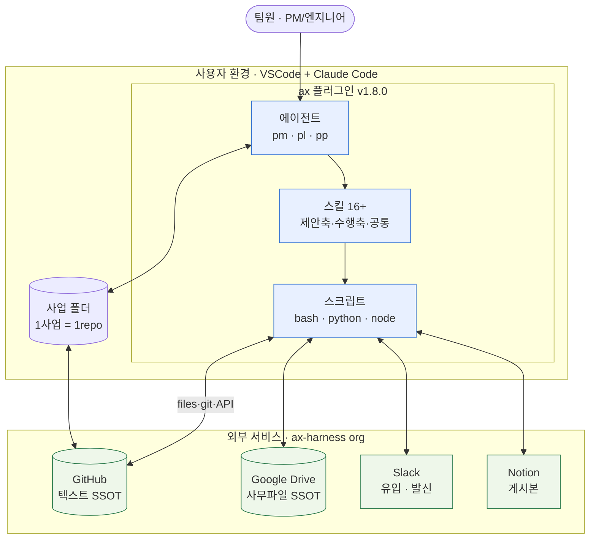
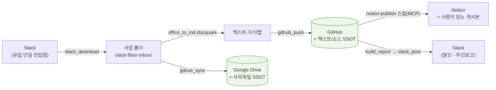
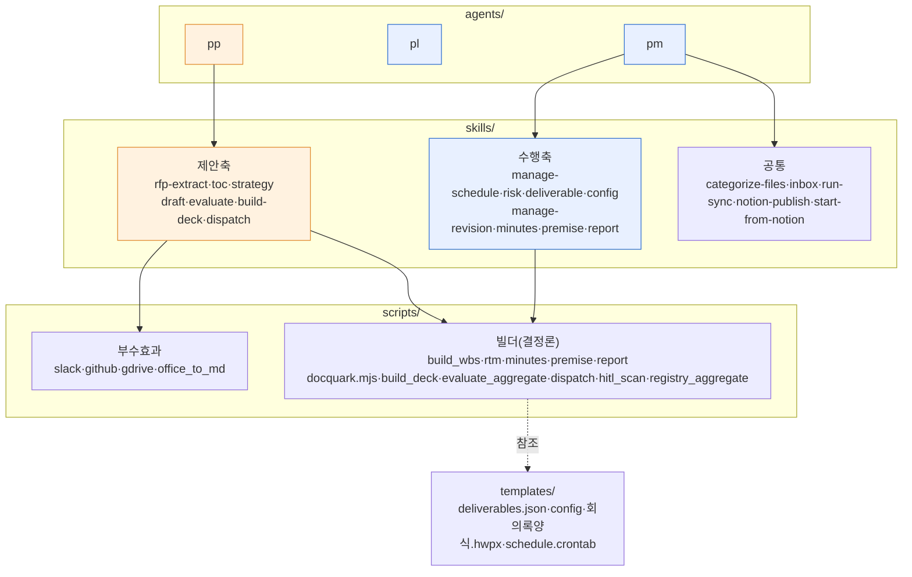
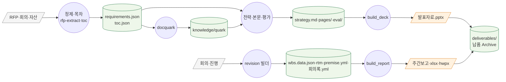
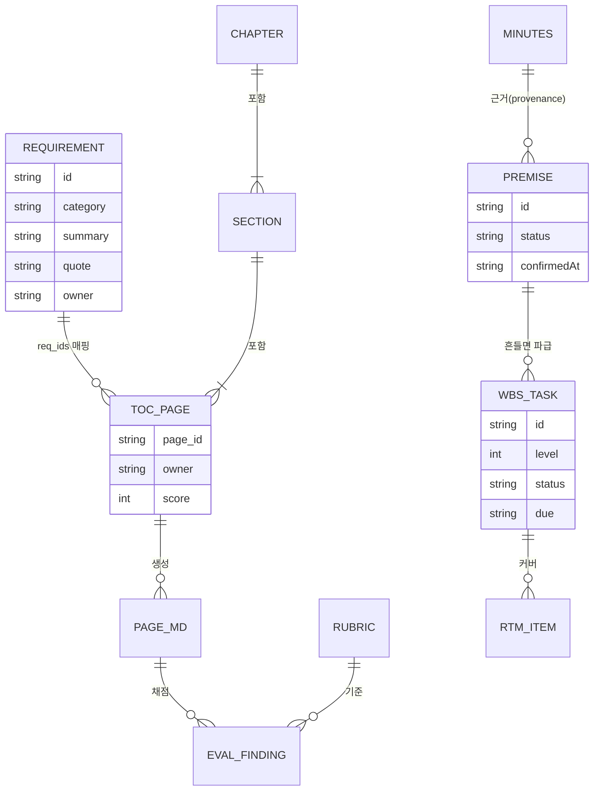
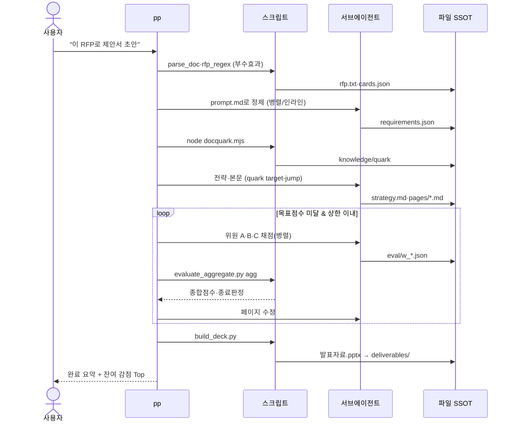
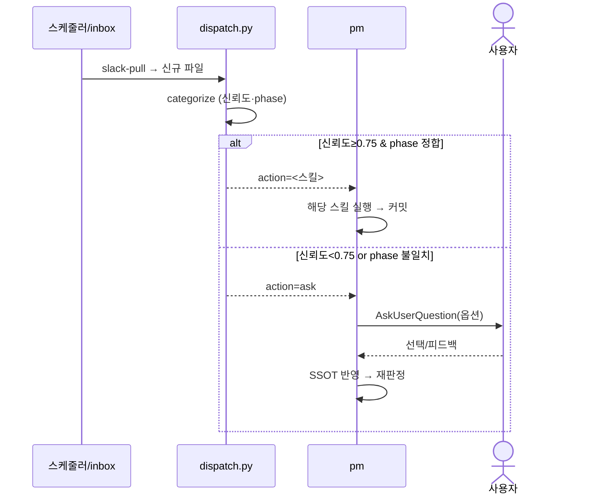
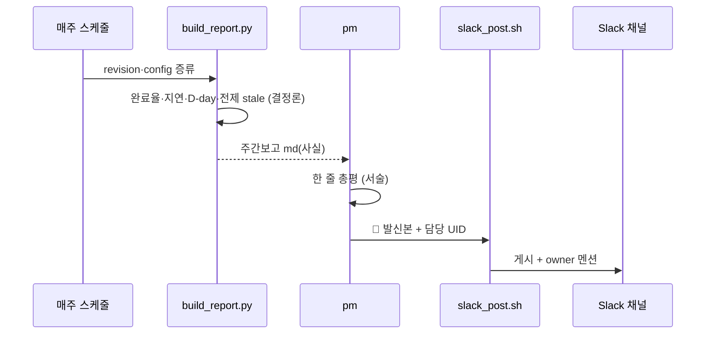
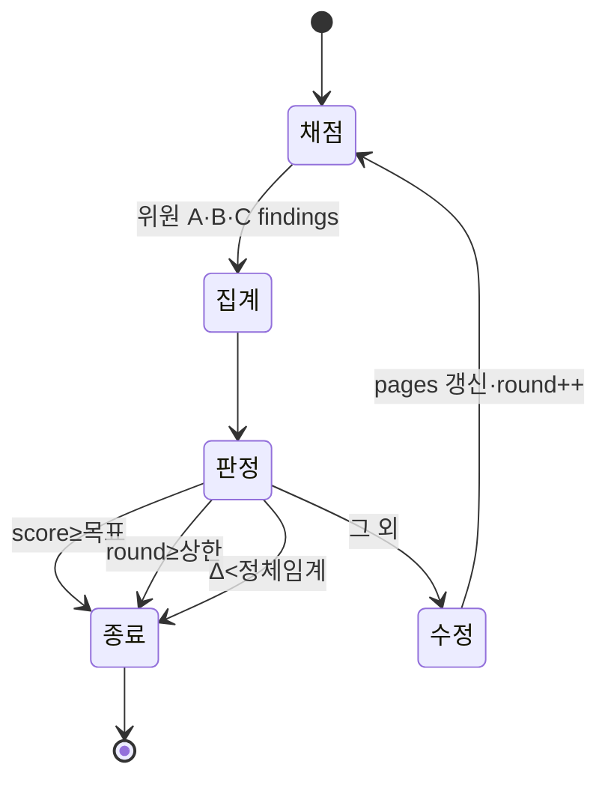
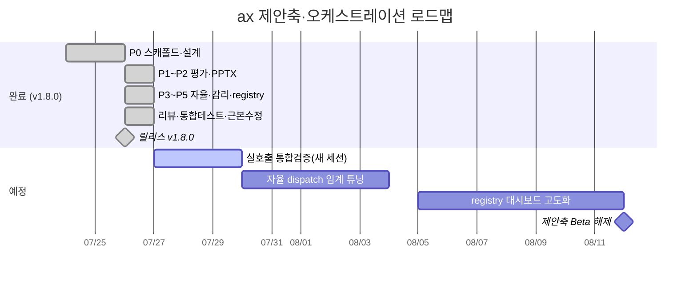

# ax 도식 명세서 (Diagram Specification)

| 항목 | 내용 |
|---|---|
| 문서명 | ax 아키텍처 도식 명세서 |
| 버전 | v1.8.0 |
| 작성일 | 2026-07-26 |
| 근거 | [`docs/ARCHITECTURE.md`](ARCHITECTURE.md) · [`docs/design/`](design/) |
| 대상 | 설계 검토·유지보수·팀 온보딩 |

> 본 명세서는 ax 도구의 **시스템·컴포넌트·데이터·프로세스·상태·일정**을 표준 도식으로 정리한다. 각 도식은 **목적 → 도해 → 설명**으로 구성한다. (본문 흐름도 4종은 `ARCHITECTURE.md` §1·§2·§6 참조)

## 도식 목록
| No | 명칭 | 유형 |
|---|---|---|
| D-1 | 시스템 구성도 | Context |
| D-2 | 4-스택 SSOT 배포 구성도 | Deployment |
| D-3 | 플러그인 컴포넌트 구성도 | Component |
| D-4 | 데이터 흐름도(DFD Lv.1) | DFD |
| D-5 | 데이터 모델(ERD) | ERD |
| D-6 | 시퀀스 — 제안 파이프라인 | Sequence |
| D-7 | 시퀀스 — 자율 dispatch + HITL | Sequence |
| D-8 | 시퀀스 — 주간보고 발신 | Sequence |
| D-9 | 상태 전이도 — 평가 반복 | State |
| D-10 | 개발 로드맵 | Gantt |

---

## D-1. 시스템 구성도 (Context)

**목적**: 사용자 환경·ax 플러그인·외부 서비스·사업 폴더의 전체 관계.

**설명**: 인증 경계는 **ax-harness org 멤버십**(A7). 부수효과(git·API)는 스크립트만 수행하고, 에이전트는 사업 폴더(SSOT)와 파일로만 상호작용한다(A3).

---

## D-2. 4-스택 SSOT 배포 구성도 (Deployment)

**목적**: 자료 유형별 SSOT 소재와 핸드오프 경로.

**설명**: `.md`·소스는 GitHub, 대용량 사무파일(hwp·ppt·xls·pdf)은 Google Drive 가 SSOT(하이브리드, A2). 중복은 rclone 체크섬으로 멱등 제거. GitHub↔Notion은 게시, GitHub→Slack은 주간보고 발신(역방향).

---

## D-3. 플러그인 컴포넌트 구성도 (Component)

**목적**: `plugin/ax/` 모듈 구조와 의존.

**설명**: 에이전트→스킬→스크립트 단방향 호출. 인지 스킬은 `prompt.md`+`schema.json`을 동반. 부수효과는 엔트리포인트 스크립트로만.

---

## D-4. 데이터 흐름도 (DFD Level-1)

**목적**: 외부 입력 → 처리(빌더) → 데이터 저장소(SSOT) → 파생 산출.

**설명**: 구조화 데이터(json/yml)가 SSOT, 빌더가 md(리뷰)+납품본(pptx/xlsx/hwpx)을 파생(D2). 작업본 ⊥ 납품본 경로 분리.

---

## D-5. 데이터 모델 (ERD)

**목적**: 제안축·수행축 SSOT 엔티티 관계.

**설명**: 제안축(REQUIREMENT↔TOC↔PAGE↔EVAL)과 수행축(WBS↔RTM, PREMISE←MINUTES)의 참조 관계. PREMISE는 회의록을 증류하며 신선도(확인시점 vs git 커밋)로 stale 판정.

---

## D-6. 시퀀스 — 제안 파이프라인

**목적**: RFP 투입부터 발표자료까지 에이전트·스크립트·파일 상호작용.

---

## D-7. 시퀀스 — 자율 dispatch + HITL

**목적**: 드롭 자료 자동 라우팅과 사용자 확인(자율 ≠ 맹목).

---

## D-8. 시퀀스 — 주간보고 발신 (H2)

**목적**: 결정론(사실) ⊥ 서술 ⊥ 발신 분리 입증.

---

## D-9. 상태 전이도 — 평가 반복 (evaluate)

**목적**: 3-Agent 평가 루프의 종료조건(무한루프 방지).

---

## D-10. 개발 로드맵 (Gantt)

**목적**: P0~P5 진행과 후속 일정(표현용).

---

*본 명세서의 도식은 GitHub 마크다운(Mermaid)에서 자동 렌더된다. 수정 시 `ARCHITECTURE.md`와 정합을 유지한다.*
