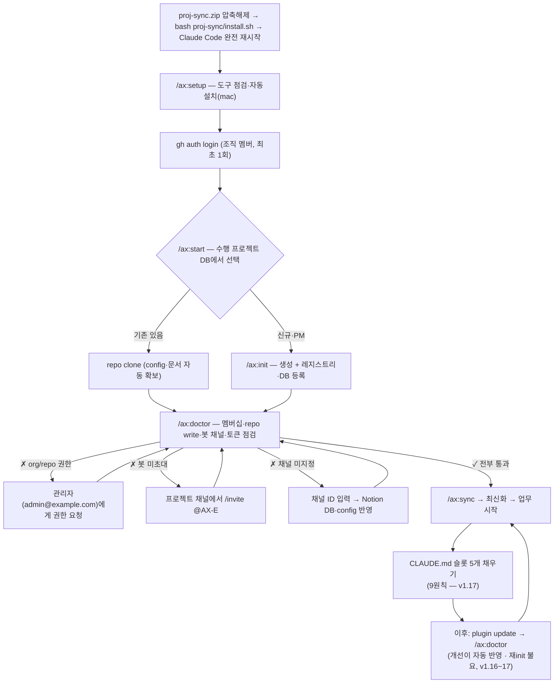
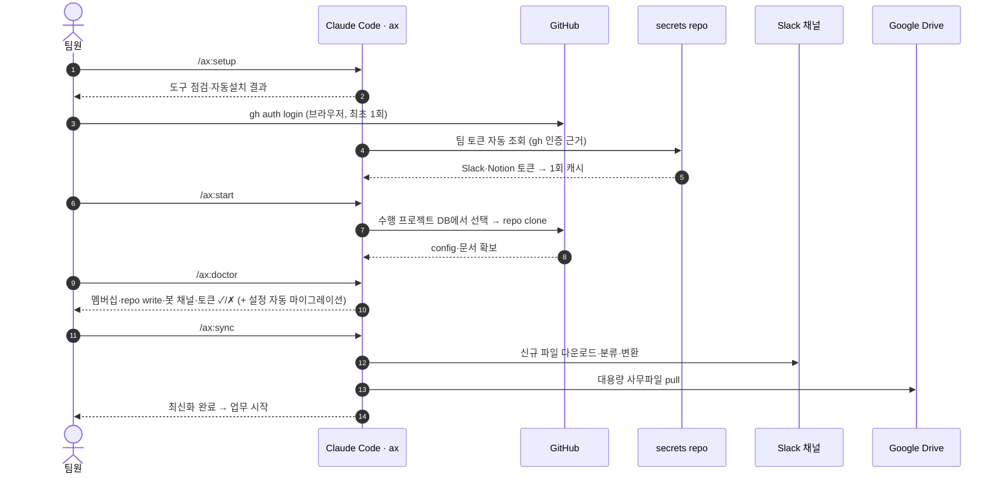

# ax 설치·합류 온보딩 가이드 (v1.20.3)

> 작성자: 엔지니어링팀 · 버전: ax v1.20.3 (2026-08-31) · 문의: 엔지니어링팀  
> 종합 안내(구성·릴리즈·아키텍처)는 별도 종합 문서 참고. 본 문서는 **신규 합류자 실무 절차**.

## 요약

- **ax** = 사업 산출물을 GitHub(원본 SSOT) ↔ Slack ↔ Notion 으로 동기화하는 Claude Code 플러그인.
- 합류 흐름: **설치 → 수행 프로젝트 DB에서 선택 → 동기화 → 업무 시작**.
- 사용자 입력은 사실상 `gh auth login` 한 번뿐 — **Slack 토큰은 입력하지 않습니다**(조직 멤버면 자동 조회).
- 설치·다운로드·push 는 **터미널에서 직접**, 분석·작성·점검은 **에이전트(채팅)**.

## 0. 절차 한눈에 (흐름도)



## 1. 전제 (시작 전 1회) — doctor가 모두 점검

| 전제 | 왜 필요 | 안 될 때 |
|---|---|---|
| **조직 GitHub org 멤버** | clone·레지스트리·Slack 토큰 자동조회의 기반 | 엔지니어링팀 **관리자**(admin@example.com)에게 멤버 등록 요청 |
| **repo write 권한** | `github-push`(저장)에 필요 (멤버여도 read-only면 거부) | 관리자에게 해당 repo write 권한 요청 |
| **(PM) 채널에 `@AX-E` 봇 초대** | `slack-pull/push` 동작 전제 | 프로젝트 채널에서 `/invite @AX-E` (비공개는 채널 멤버가 초대) |
| **(선택) Notion 커넥터** | 수행 프로젝트 DB·문서함 사용 시 | claude.ai 에서 Notion 커넥터 1회 연동 |

## 1-1. 계정·토큰 — 무엇을 입력하나 (한눈에)

> 핵심: 사용자가 **손으로 넣는 토큰이 없습니다.** GitHub은 `gh auth login`(브라우저), Slack은 자동 조회, Notion은 **각자의 claude.ai 커넥터**, Google Drive는 `setup-remote`(브라우저 인증 1회) — 전부 브라우저 인증이거나 자동입니다.
> **v1.21.0 — Claude Code 계정이 사용자마다 개인 계정입니다.** 팀 토큰은 Slack 봇 하나뿐이고, Notion 게시와 Drive 전송은 **로그인한 본인 계정** 명의로 됩니다.

| 서비스 | 직접 입력? | 방식 | 저장 위치 |
|---|---|---|---|
| **GitHub** | ❌ (토큰 발급 불필요) | `gh auth login` — 브라우저 로그인(조직 멤버, 최초 1회). gh가 토큰을 관리 | gh 자격증명 저장소 |
| **Slack** | ❌ (입력 불필요) | gh 로그인(=조직 멤버)이면 `/ax:auth`·`/ax:sync`가 private repo에서 **봇 토큰 자동 조회**·1회 캐시 | `~/.proj-sync/credentials` (자동) |
| **Notion** | ❌ (토큰 없음) | **claude.ai Notion 커넥터 1회 연동**(개인 OAuth). Claude Code 에서 `/mcp` 로 연결 상태 확인. 게시본 작성자 = 본인 (v1.21.0 — 팀 REST 경로 없음) | claude.ai 커넥터 |
| **Google Drive** | ⭕ **브라우저 인증 1회** | 사업 폴더에서 `bash …/gdrive_sync.sh setup-remote` (`/ax:doctor` 가 안내) — **본인 Google 계정**으로 인증. **마운트 불요** — rclone 이 전송하고 자격증명도 보관 | rclone 설정 파일 (`~/.config/rclone`) |

- **GitHub 개인 토큰(PAT) 발급은 불필요** — 과거 방식이며, 현재는 `gh auth login` 권장(브라우저 인증, 토큰은 gh가 보관).
- 모든 자격증명은 **`.env`(자동 gitignore)** 또는 gh/커넥터가 관리 → **채널·커밋·zip·노션에 토큰 붙여넣기 금지**.
- 입력값 점검은 `/ax:doctor` 한 번으로 (GitHub 멤버십·repo write·Slack 봇·Notion·Drive 연결 동시 확인).

## 2. 설치 (가장 쉬운 방법)

> ⚠️ 설치·다운로드·push 는 **터미널에서 직접** 실행합니다. Claude 채팅창에 "설치해줘/실행해줘"라고 시키면 보안 기능이 막을 수 있습니다.

1. 받은 **`proj-sync.zip`** 을 VS Code로 연 사업 폴더에 두고 **압축 해제**
2. 터미널(Windows 는 **Git Bash**)에서: `bash proj-sync/install.sh`
3. **Claude Code 완전 재시작** → `/ax:*` 명령이 보입니다 (소프트 리로드 ✗)

- git-url 방식(자동 업데이트): `claude plugin marketplace add hank-netpg/proj-sync-harness` → `claude plugin install ax@ax-harness`
- zip(install.sh) 설치는 로컬 디렉토리 소스라 `plugin update` 로 최신본을 못 받습니다 → 새 zip 재실행, 또는 위 git-url 로 재등록.

### 2-1. 이미 설치했다면 — 업데이트 (v1.16~1.17)

```bash
claude plugin marketplace update ax-harness && claude plugin update ax@ax-harness
# 그 다음, 각 사업 폴더에서 1회
/ax:doctor
```

- **재`/ax:init` 은 필요 없습니다.** `doctor` 가 **additive 마이그레이션**을 자동 적용합니다 — *없는 키만 추가 · 배열은 append 만 · 파일은 없는 것만 생성 · 기존 값은 건드리지 않음*.
- 미리 보고 싶으면 `bash "${CLAUDE_PLUGIN_ROOT}/scripts/config_migrate.sh" --dry-run`, 자동 적용을 막으려면 `PS_NO_MIGRATE=1`.
- doctor 는 **지금 도는 사본 ↔ GitHub Release 최신 버전**도 대조합니다 — 낡은 사본이면 update 명령을 알려줍니다.

## 3. 첫 사용 — 기존 사업 합류

| 순서 | 명령 | 하는 일 |
|---|---|---|
| 1 | `/ax:setup` | 도구(git·gh·Git LFS·Python) 점검 — 없으면 자동 설치(mac) |
| 2 | `gh auth login` | GitHub 로그인(조직 멤버, 최초 1회·브라우저) |
| 3 | `/ax:start` | 수행 프로젝트 DB에서 선택 → repo clone(설정·문서 자동) |
| 4 | `/ax:doctor` | 멤버십·repo·봇채널·토큰 점검(토큰 자동조회) |
| 5 | `/ax:sync` | Slack 최신 파일까지 받아 최신화 → 업무 시작 |
| 6 | **`CLAUDE.md` 슬롯 채우기** | 사업 폴더 루트 `CLAUDE.md` 의 **빈칸 5개**를 채웁니다 (v1.17.0~, 아래 3-1) |



> ✅ 자격증명 입력은 사실상 `gh auth login` 한 번뿐. 다만 아래 3-1 은 **사람이 판단해 채워야 합니다.**

### 3-1. 9원칙과 `CLAUDE.md` 슬롯 (v1.17.0~)

모든 사업 폴더에 두 파일이 자동으로 생깁니다. **신규는 `/ax:init`, 이미 있는 사업은 `/ax:doctor` 가 만듭니다** — 재init 은 필요 없습니다.

| 파일 | 무엇 | 손대는가 |
|---|---|---|
| `reference/9원칙.md` | 원칙 본문 — 9개 원칙 + 각각의 **위반 신호·확인 방법** | ❌ 읽기만 (도구가 배포) |
| `CLAUDE.md` (사업 루트) | 이 사업의 지침 — **빈칸 5개** | ✅ **직접 채웁니다** |

○ **채울 5개** — 1순위 정의 · 회귀 게이트 · SSOT 위치 · 자원 격리 · 레슨 로그
  - `SSOT 위치`·`자원 격리` 는 표준값이 이미 적혀 있어 그대로 두어도 됩니다.
  - **`1순위 정의`** 는 반드시 채웁니다 — 이 사업이 9원칙보다도 먼저 지킬 가치(예: 데이터 정확성 / 규정 준수 / 응답 지연).
  - `회귀 게이트` 가 아직 없으면 **"없음"과 그 이유**를 적습니다. 빈칸으로 두지 않습니다.

○ **왜 채워야 하나** — 비워 두면 원칙이 **절반만 작동**합니다. 우선순위 판단(`1순위 > 9원칙 > 시간·비용 효율`)의 맨 윗칸이 비면, 급할 때 무엇을 지킬지 정할 근거가 없습니다.

○ **개인 전역 규칙(`~/.claude/CLAUDE.md`)과 충돌하면 사업 `CLAUDE.md` 가 우선**합니다. 전역은 사람 단위 취향, 이쪽은 사업 단위 계약이라 팀원이 바뀌어도 같아야 합니다.

○ **먼저 읽을 곳** — `reference/9원칙.md` 의 §2(측정)·§3(실패 가시화)·§4(완료의 정의). 실제 사고는 원칙을 몰라서가 아니라 **「충족했다고 믿었는데 아니었던」** 형태로 일어납니다.

> ⚠️ doctor 출력에 `⚠ 스캐폴드 실패` 가 보이면 넘기지 마세요 — 두 파일을 받지 못한 것입니다. 대개 낡은 사본이므로 `claude plugin update ax@ax-harness` 후 `/ax:doctor` 재실행이 답입니다.

## 3-2. 세션을 열면 직전 맥락이 먼저 뜹니다 (v1.20.0~)

사업 폴더에서 Claude 세션을 열면, 그 저장소의 **직전 작업 맥락(결정·미해결·일정)** 이 먼저 주입됩니다. 다른 팀원이 다른 머신에서 하던 일을 이어받을 때 설명을 다시 듣지 않아도 됩니다.

- 출처는 `revision/history.md`·`premise.yml`·`config.wbs` — **git 으로 이미 공유되는 파일**입니다. 대화 내용이 공유되는 것이 아닙니다.
- 말할 게 없으면 아무것도 뜨지 않습니다. 어떤 경우에도 세션 시작을 막지 않습니다.
- **한 일을 `revision/history.md` 에 2~3줄 적어두세요.** 다음 사람이 이어받을 근거가 그것뿐입니다. `/ax:github-push` 가 오늘자 항목이 없으면 알려주지만, 동기화를 막지는 않습니다.

## 3-3. 커밋 메시지 규약 (v1.20.1~)

**코드가 「무엇」을 말하니 커밋은 「왜」를 말합니다.** `git diff` 로 아는 것을 커밋이 되풀이하면 두 벌이 됩니다.

- 형식: `type(scope): 설명` — 릴리즈는 `chore(release):`
- 길이는 **문자 수가 아니라 표시 폭** — 한글은 한 자가 2칸(72칸 ≈ 한글 36자)
- `feat`·`fix`·`refactor`·`perf` 는 **본문에 왜를 적습니다**

`/ax:github-push` 기본 메시지는 규약을 따릅니다. 직접 준 메시지가 어긋나면 알려주지만 **동기화를 막지는 않습니다.**

훅을 켜면 로컬에서 걸러집니다(선택).

```bash
AX="$(ls -d ~/.claude/plugins/*/ax 2>/dev/null | head -1)"
mkdir -p .githooks && cp "$AX/templates/commit-msg" .githooks/ && chmod +x .githooks/commit-msg
git config core.hooksPath .githooks
```

전문은 플러그인 루트 `COMMIT_CONVENTION.md`.

## 4. Slack 토큰은 입력하지 않습니다 — Notion·Drive 는 본인 계정입니다

- 팀 공용 봇 토큰은 **private repo** 에만 있고, `gh` 로그인(=조직 멤버)이면 `doctor`·`sync` 가 자동으로 가져와 1회 캐시합니다.
- 수동이 필요하면: `/ax:auth`
- **Notion**(v1.21.0): 팀 토큰이 아닙니다. claude.ai 에서 Notion 커넥터를 1회 연동하면 Claude 가 **본인 명의**로 게시합니다. 문서함 DB 편집 권한이 없으면 게시가 실패하니 담당자에게 권한을 요청하세요.
- **Google Drive**(v1.21.0): `setup-remote` 1회로 **본인 Google 계정** 브라우저 인증을 합니다. 인증이 「관리자가 차단함」으로 거절되면(E12) Workspace 관리자가 서드파티 앱(rclone)을 막은 것입니다 — 담당자를 통해 관리자에게 rclone 허용(앱 접근 통제)을 요청하세요. 재인증으로는 풀리지 않습니다.
- ⚠️ 토큰을 채널·커밋·zip에 붙여넣지 마세요.

## 5. 명령어 전체 (19종)

**처음엔 이 5개만 알면 됩니다** — `/ax:setup` → `/ax:start` → `/ax:doctor` → `/ax:sync`, 그리고 저장할 때 `/ax:github-push`.

| 명령 | 용도 |
|---|---|
| `/ax:setup` | 사전 도구 점검·자동설치 (머신당 1회) + GitHub 로그인·Slack 팀 토큰 자동 조회 |
| `/ax:start` | 기존 사업 합류 — DB 선택→clone→동기화 |
| `/ax:init` | 새 사업 시작(PM) — 생성 + 레지스트리·DB 등록 |
| `/ax:doctor` | 멤버십·repo·봇채널·토큰 점검 + **설정 자동 마이그레이션**(v1.16) + **9원칙·CLAUDE.md 배포**(v1.17) |
| `/ax:auth` | Slack 팀 토큰 1회 설정(기본은 자동조회). Notion·Drive 는 본인 계정이라 해당 없음 |
| `/ax:vscode` | VSCode 태스크 설치 (기존 프로젝트에 나중에 추가할 때) |
| `/ax:sync` | 전체 동기화 (slack-pull → github-push → Google Drive → Notion) |
| `/ax:slack-pull` | Slack 채널 파일 다운로드·분류 |
| `/ax:slack-push` | 파일을 Slack에 업로드(+@멘션) |
| `/ax:slack-delete` | Slack 메시지 회수 (기본은 조회만, 삭제는 `--yes`) |
| `/ax:github-push` | 로컬 → GitHub (LFS+secret-scan+commit+push) |
| `/ax:inbox` | 채널 신규 메시지 폴링 → 요청·확인 필요 항목 트리아지 |
| `/ax:registry-sync` | Notion 수행 프로젝트 DB → registry.json 현행화 |
| `/ax:phase` | 사업 단계 전환(제안→수주→수행중→완료→보류→실주) + Notion 상태 동기화 |
| `/ax:revision` | WBS·요구사항추적표 재생성 — md(작업) + xlsx(납품), 매일 commit-push |
| `/ax:premise` | 사업 전제 레지스터 빌드 — `premise.yml` → `PREMISE.md`(신선도 자동 판정) |
| `/ax:minutes` | 회의록 빌드 — `회의록/*.yml` → md(리뷰) + hwpx(납품, 양식 보존) |
| `/ax:report` | 주간보고 빌드·발신 — 진척·리스크 계산 → PM 총평 → Slack 게시 |
| `/ax:doc-audit` | 산출물 문서 구조 감사 — 중복·구조이상·아카이브 대상 판정 |

> 분석·작성은 에이전트로: `@agent-ax:pm`(진도·산출물·위험 점검) · `@agent-ax:pl`(문서 분석·초안) · `@agent-ax:pp`(RFP→제안서→발표자료, 상세는 **제안 파이프라인 가이드**).

## 6. 새 사업을 시작하는 PM용

1. 사업 폴더에서 `/ax:init` → 레지스트리에 없는 '신규' 선택 → 사업명·GitHub repo·**Slack 채널 ID** 입력
2. 생성 후 **레지스트리 등록**(다음 사람이 `start`로 고를 수 있도록)
3. **프로젝트 Slack 채널에 `@AX-E` 봇 초대** (`/invite @AX-E`)
4. Notion **수행 프로젝트 DB** 에 프로젝트 추가·상태·채널 기입 → `/ax:registry-sync` 로 registry.json 미러 갱신

> 채널이 비어 있던 기존 프로젝트는 `start`/`init` 시 Claude가 **채널 ID를 대화형으로 물어** Notion DB·config에 반영합니다.

## 7. 트러블슈팅

| 증상 | 해결 |
|---|---|
| `/ax:*` 명령이 안 보임 | Claude Code **완전 재시작**(소프트 리로드 ✗) → `/plugin list` 확인 |
| `plugin update` 가 최신본 안 받음 | zip 설치(로컬 소스)라서 — 새 zip 재실행, 또는 git-url(`add hank-netpg/proj-sync-harness`)로 재등록 |
| doctor에서 Git LFS 등 도구 ✗ | "자동 설치해줘" → mac은 Homebrew로 자동 설치 |
| doctor에서 GitHub 로그인 ✗ | `gh auth login` (브라우저 인증) |
| doctor에서 **org 멤버 아님** ✗ | 엔지니어링팀 **관리자**에게 조직 멤버 등록 요청 |
| doctor에서 **repo read-only** ✗ | 관리자에게 해당 repo write 권한 요청 |
| doctor에서 **봇 채널 미초대** ✗ | 프로젝트 채널에서 `/invite @AX-E` |
| doctor에서 Slack 토큰 ✗ | `gh auth login` 확인 → `/ax:auth` |
| Windows 빨간 `$'\r'` 오류 | `bash <(tr -d '\r' < proj-sync-setup.sh)` |
| 명령은 도는데 **개선이 안 보임** | 낡은 사본입니다 → §2-1 업데이트 후 `/ax:doctor` |
| **노션에 아무것도 안 올라감** | 게시 대상 규칙 미설정 — `config.notion.publish.globs` 확인 (v1.9 부터 필수) |
| 제안축(`@agent-ax:pp`) 실행 실패 | `/ax:doctor` §5.5 런타임 점검 — Node.js 18+ · python-pptx · PyYAML · lxml |

## 8. 알아두기

- **하이브리드 저장**: GitHub는 텍스트 산출물(.md 등) 원본(SSOT), 대용량 바이너리(발표자료·slack-files)는 Google Drive/Slack. `clone`은 텍스트를 받고, 필요한 첨부는 `sync`로 받습니다.
- **수행 프로젝트 DB**(공용 레지스트리)는 엔지니어링팀 홈에서 볼 수 있습니다.
- 설치·운영 상세는 zip 안 `INSTALL.md` · `MANUAL.md` · `dist/ARCHITECTURE.md` 동봉.

## 약점·한계 (정직)

- **zip(install.sh) 설치는 자동 업데이트 불가** — 새 zip 재실행 또는 git-url 재등록 필요.
- 담당자(관리자) 연락 경로는 작성 시점(2026-08-07) 기준. 조직 변동 시 갱신 필요.
- **`/ax:doctor` 를 안 돌리면 §2-1 의 자동 마이그레이션도 안 걸립니다.** 업데이트 후 사업 폴더마다 1회는 돌려야 합니다.
- 본 문서는 v1.20.3 기준.
- **Google Drive 회사 계정 관리자 절차 (담당자, v1.21.0)**: 회사 GCP 프로젝트(동의화면 **Internal** · Desktop app client) → `client_id`/`secret` 을 secrets repo 에 등록 → 관리자 콘솔 앱 접근 통제에서 「내부 앱 신뢰」 확인. 브라우저 인증이 불가한 환경은 서비스 계정 + 공유 드라이브. 상세·근거·검증 필요 항목은 **팀 토큰 운영 가이드**(secrets-admin.md) 참고. **파일럿(회사 계정 1명)으로 확정 전까지는 「검증 필요」 상태입니다.**
- **Slack scope 요청 절차 (inbox 회신용, 담당자)**: `/ax:inbox` 회신에는 봇 앱에 `chat:write` scope 가 필요합니다 (비공개 채널 폴링은 `groups:history` 추가). 앱 관리자: api.slack.com/apps → AX-E 앱 → OAuth & Permissions → scope 추가 → **Reinstall to Workspace**. scope 없이도 수신·트리아지는 동작(회신만 불가) — `/ax:doctor` 가 유무를 표시합니다.

---

*출처: github.com/hank-netpg/proj-sync-harness (PRIVATE) · Release v1.20.3 · 본 문서 docs/notion/onboarding-guide.md*
