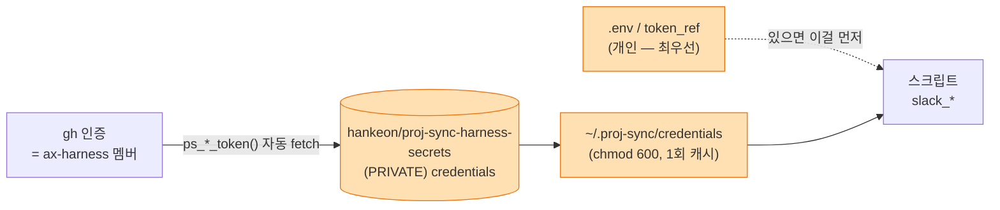
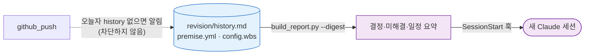
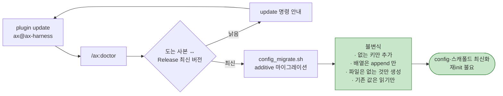
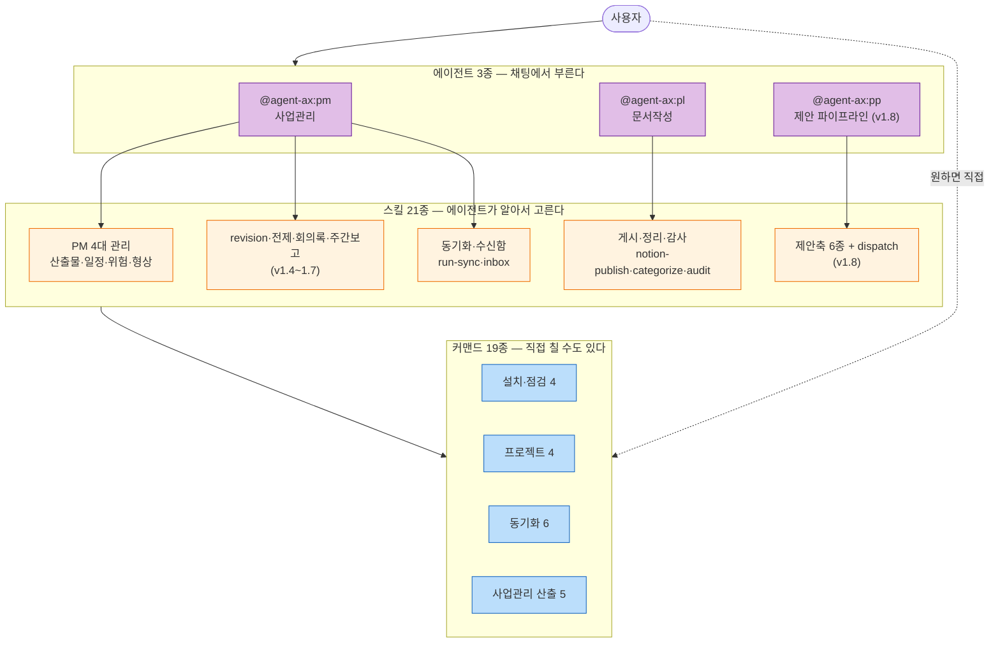
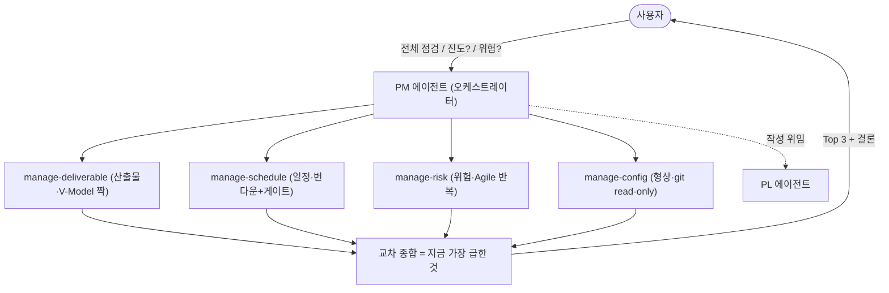

# ax — 설치·운영·릴리즈 종합 안내 (v1.20.3)

> 작성자: 엔지니어링팀 · 버전: ax v1.20.3 (2026-08-31 — 게시 프로퍼티 보존) · 문의: 엔지니어링팀  
> **ax** · 사업(프로젝트)별 자료를 GitHub(원본 SSOT) ↔ Slack ↔ Notion ↔ Google Drive 로 표준 동기화하는 Claude Code 플러그인. IP-AX·엔지니어링팀 공통 배포. 설치는 터미널 1회, 이후 동기화·분석·작성·제안서 작성은 PM·PL·PP 에이전트가 직접 수행.

| 항목 | 내용 |
|---|---|
| 플러그인 | `ax` — 커맨드 `/ax:*` 19종, 에이전트 `@agent-ax:pm`·`@agent-ax:pl`·`@agent-ax:pp` |
| 버전 | **1.20.3** (v1.1.0 팀 토큰 → v1.2.0 에이전트 직접 실행 → v1.4~1.7 revision·전제·회의록·주간보고 → **v1.8.0 제안축** → v1.9~1.10 Notion 게시 생명주기·문서구조 감사 → v1.11~1.12 외부참조·델타 → v1.13~1.16 init 정합·**additive 마이그레이션** → v1.17~1.18 배포 게이트·오탐 가드 → **v1.19.0 NAS→Google Drive 전환** → v1.19.1~2 Drive pull·한국어 Windows·init heredoc → v1.20.0 세션 연속성·게시 구조 소실 수정 → v1.20.1 커밋 규약 → v1.20.2 게시 본문 개행 수정 → **v1.20.3 게시 프로퍼티 보존**) |
| 레포 | github.com/hankeon/proj-sync-harness (PRIVATE) |
| 마켓플레이스 | `ax-harness` (git-url: `hankeon/proj-sync-harness`) |
| 대상 | IP-AX 비즈니스실 / 엔지니어링팀 |
| 작업환경 | VSCode + Claude Code + GitHub + Slack + Notion (전원 동일) |
| 세션 훅 | `SessionStart` 2종 — 낡은 사본 알림(`version_notice`) · 직전 작업 맥락 주입(`context_digest`, v1.20.0). 둘 다 말할 게 없으면 침묵하며 세션 시작을 막지 않는다 |

## 1. 핵심 흐름

```mermaid
flowchart LR
    SL[("Slack 채널<br/>= 자료 단일 진입점")] -->|slack-pull| LOCAL["로컬 사업 폴더<br/>(카테고리 분류·오피스 변환)"]
    LOCAL -->|github-push<br/>단방향| GH[("GitHub repo<br/>텍스트 SSOT")]
    LOCAL -->|gdrive_sync<br/>체크섬 멱등| GD[("Google Drive<br/>대용량 사무파일 SSOT")]
    LOCAL -->|slack-push<br/>+@멘션| SL
    LOCAL -->|notion-publish| NOT[("Notion 문서함<br/>사람이 읽는 곳")]

    CFG["config.wbs · rtm.data.json<br/>(SSOT)"] -->|revision<br/>매일 commit-push| REV["revision/*.md (작업)<br/>deliverables/*.xlsx (납품)"]
    REV --> LOCAL

    RFP([RFP hwpx·pdf]) -->|제안축 6단계| PROP["proposal/*.json · pages/*.md"]
    PROP --> PPTX["발표자료.pptx → deliverables/"]
    PPTX --> LOCAL

    classDef store fill:#e3f2fd,stroke:#1565c0
    classDef work fill:#f3e5f5,stroke:#6a1b9a
    class SL,GH,GD,NOT store
    class LOCAL,REV,PROP,PPTX work
```

- **GitHub = 단일 진실원천(SSOT)**. 로컬에서 push만, GitHub 직접 편집 안 함.
- **revision 축**: 프로젝트마다 `revision/`(history·WBS·요구사항추적표)을 매일 commit-push. WBS 는 `config.wbs`(SSOT), 요구사항추적표는 `rtm.data.json`(SSOT) → `/ax:revision` 이 **md(작업)→`revision/`, xlsx(납품)→`deliverables/`** 로 빌드. 상세는 ARCHITECTURE §2-3.
- **deliverables 2분할**: 산출물 = 납품 Archive(`deliverables/`, 고객 as-is 최종본, 전부 git) ⊥ 작업본(`reference/drafts/` 초안 md + `revision/`). 상세는 ARCHITECTURE §2-4.
- **제안축(v1.8.0)**: RFP 를 넣으면 요구사항 추출 → 목차 → 전략 → 본문 → 평가 → 발표자료까지 `@agent-ax:pp` 가 순차 구동. 상세는 **제안 파이프라인 가이드**.
- 시크릿은 절대 커밋 안 됨(`.env` gitignore + push 전 secret-scan).
- 부수효과(다운로드·push·업로드)는 **표준 스크립트 엔트리포인트로만** — v1.2부터 에이전트도 직접 실행 가능(터미널 경로 병행). 토큰은 스크립트가 내부 해석(env→캐시→secrets repo), 에이전트는 토큰을 만지지 않음. auto 모드에서 자격증명 단계 차단은 정상(사용자 위임).

## 1-1. Google Drive — 대용량 사무파일 저장 (하이브리드 SSOT)

> **v1.19.0 — NAS(Synology)에서 Google Drive 로 교체.** 전송은 **rclone** 이 담당합니다.
> claude.ai Drive 커넥터에는 **로컬 경로 업로드가 없어** 파일을 base64 로 에이전트 컨텍스트에
> **두 번**(스크립트 출력 → 도구 인자) 통과시켜야 합니다 — 64KiB 가 약 70k 토큰, 1MiB 는 약 1.1M 토큰
> (v1.21.0 설계 실측). 대용량이 이 저장소의 존재 이유라 성립하지 않습니다.
> 커넥터는 조회·공유 링크 같은 보조에만 씁니다. rclone 은 크기 제한이 없고, 부수효과가 스크립트
> 엔트리포인트에 남아 A3 원칙을 지키며, 스케줄러·헤드리스(`claude -p`)에서도 동작합니다.
> 대가는 **머신당 1회 `setup-remote`**(브라우저 인증) 입니다. 자격증명은 **사용자 본인 Google 계정**입니다.
>
> **v1.21.0 — 개인 OAuth 단일화.** Workspace 관리자가 서드파티 앱(rclone)을 막으면 인증이 거절됩니다(E12).
> 이 경우 관리자에게 rclone 허용(앱 접근 통제)을 요청하는 것이 유일한 해법입니다 — 코드 우회 경로는 없습니다.

> **하이브리드 정책**: 텍스트 산출물(.md·소스)은 GitHub가 SSOT, **대용량 사무파일(hwp·ppt·xls·pdf 등)은 Google Drive 가 SSOT**. GitHub에 대용량 바이너리를 올리지 않아 레포를 가볍게 유지한다. (출처: `plugin/ax/scripts/gdrive_sync.sh`, `start.md`)

| 항목 | 내용 |
|---|---|
| 저장소 | Google Drive — `{team_folder}/{project_id}/` (rclone remote 경유) |
| 대상 확장자 | hwp·hwpx·doc·docx·ppt·pptx·xls·xlsx·pdf·png·jpg·gif·zip (`config.gdrive.upload_exts`) |
| 동기화 | `gdrive_sync.sh init`(폴더 생성) / `push`(로컬→Drive) / `pull`(Drive→로컬) / `status`·`doctor` |
| 중복 제거 | **원격 md5 체크섬 비교** — 같은 내용이면 다시 안 올림. 원격의 실제 해시라 매니페스트가 어긋날 여지가 없다 |
| 버전·충돌 | 사무파일은 git처럼 병합 불가 → 해시 다르고 Drive 가 더 최신이면 **push 전 충돌 경고**(승인 시 `.bak-<epoch>` 백업 후 덮어쓰기). 이전 버전은 **Drive 버전 기록**으로 복원 |
| 자격증명 | **rclone 이 보관** (`~/.config/rclone`) — 사용자 본인 Google 계정, `.env` 에 넣지 않는다. remote 는 `setup-remote` 가 만든다(머신당 1회 · 브라우저 인증). E12 = 조직 정책 차단(관리자 허용 필요) |

- 설정은 `config.gdrive`(remote·team_folder·base_path)에 있고, `/ax:doctor`가 연결을 점검한다.
- 합류(`/ax:start`) 시 GitHub 문서(clone) + Drive 사무파일(pull)을 **한 번에** 받아 완전한 시작.
- `/ax:sync`가 Slack→변환→GitHub→**Google Drive**→Notion 전체를 한 흐름으로 처리.

## 1-2. 팀 공용 토큰 — secrets repo 참조 구조

> **팀 공용 토큰은 Slack 봇 하나다 (v1.21.0).** Claude Code 계정이 사용자마다 개인 계정이 되면서 Notion 은 **로그인한 사용자의 claude.ai 커넥터**(명의=본인), Google Drive 는 **rclone(본인 Google 계정)** 이 담당한다. 공용 비밀은 **별도 private repo `hankeon/proj-sync-harness-secrets`** 의 `credentials` 에 보관하고, 사용자는 `gh` 인증(=ax-harness 멤버)으로 **자동 조회·캐시**한다. **이 도구 레포에는 토큰을 넣지 않는다**(secret-scan 차단).

| 키 | 필수 | 사용처 |
|---|---|---|
| `PROJ_SYNC_SLACK_BOT_TOKEN` (`xoxb-…`) | **필수** | slack-pull/push·게시(AX-E 봇 명의) — **유일한 팀 자격증명** (구 opt-in 키는 v1.21.0 에서 지원 종료 — 팀 토큰 운영 가이드 「지원 종료」 절) |



- 해석 우선순위: **`.env`/`token_ref`(개인) → 전역 캐시 → secrets repo 자동 fetch**.
- 토큰 등록·갱신(담당자) 절차는 **팀 토큰 운영 가이드** 참고.

## 1-3. 세션 연속성 — 직전 작업 맥락이 이어진다 (v1.20.0)

> 팀원이 **각자의 Claude 계정**으로 **서로 다른 머신**에서 같은 사업 저장소를 작업한다. git 은 동기화되지만 Claude Code 의 맥락은 이어지지 않아, 새 세션은 매번 백지에서 시작했다. v1.20.0 부터 `SessionStart` 훅이 저장소의 **결정·미해결·일정**을 세션에 주입한다.



| 항목 | 내용 |
|---|---|
| 왜 transcript 를 안 쓰나 | 저장 경로에 계정 slug·uuid 가 박히고 세션당 1~12MB. 이어져야 할 것은 대화 원문이 아니라 **결정·미해결·일정**이고, 그건 이미 저장소에 있다(21개 사업 전부 보유) |
| 판정 공유 | `build_report.py --digest` 가 주간보고와 `facts()`·`open_items()` 를 **공유**한다 — 판정을 복제하면 보고서와 digest 가 서로 다른 말을 하게 된다 |
| 안전 규칙 | ① 세션 시작을 막지 않는다(어떤 실패에도 통과) ② 네트워크를 타지 않는다(로컬 파일 + `git log`) ③ 말할 게 없으면 침묵한다 |
| 기록 유도 | `github_push` 가 오늘자 `history.md` 항목이 없으면 알린다. **차단하지 않는다** — 동기화를 막으면 팀원이 플러그인을 끈다. 사람이 쓴 변경이 있을 때만 말한다 |

## 1-4. 게시 구조 보존 (v1.20.0)

`md_to_notion` 의 헤딩 정규식이 `#{1,3}` 이라 **h4 이상이 헤딩으로 인식조차 되지 않고** 문단으로 떨어졌다. Notion 게시본에 `#### ` 가 리터럴로 남아 문서 구조가 사라졌다.

- 실측(2026-08-28): 제안서 본문 370파일 중 **168파일** · md헤딩 1,406개 중 **368개(26.2%)** 소실 → 수정 후 **0%**
- Notion 은 `heading_1~3` 만 있으므로 h4+ 는 `heading_3` 으로 접는다. 계층 한 단계는 잃지만 제목이라는 사실은 지킨다
- `lib/structure_gate.py` 가 헤딩·표·코드블록 소실을 **말한다**(게시는 막지 않는다). `lib/sanitize.py` 가 복사돼 들어온 제로폭·BOM·bidi 문자를 걷어낸다
- **기존 게시본에는 소급되지 않는다** — 해당 문서를 다시 게시해야 반영된다

## 1-5. 커밋 메시지 규약 (v1.20.1)

> 근거: [Conventional Commits v1.0.0](https://www.conventionalcommits.org/ko/v1.0.0/) + git 관례(72칸)
> 원칙: **코드가 「무엇」을 말하니 커밋은 「왜」를 말한다.**

`git diff` 를 보면 무엇이 바뀌었는지는 안다. 커밋이 그것을 다시 적으면 두 벌이 된다. 6개월 뒤 `git blame` 하는 사람에게 필요한 것은 **그때 무엇이 문제였는가** 다.

| 항목 | 규칙 |
|---|---|
| 형식 | `type(scope): 설명` — type 11종. 릴리즈는 `release:` 가 아니라 **`chore(release):`** |
| 길이 | **문자 수가 아니라 표시 폭**. 한글은 한 자가 2칸 — 72칸 ≈ 한글 36자 |
| 본문 | `feat`·`fix`·`refactor`·`perf` 는 **본문 필수** — 「왜」가 없으면 반려 |
| PR 제목 | **64칸**. 스쿼시 머지라 PR 제목이 곧 커밋 제목이고, GitHub 이 ` (#123)` 을 붙인다 |

문자 수로만 재면 한글 커밋은 전부 통과하면서 터미널에서는 접힌다. 실측(최근 60커밋): 제목 위반이 문자 수 기준 0건 → **표시 폭 기준 17건**, 본문은 **54/60 커밋·342줄** 초과.

**사업 저장소에 훅 설치**(선택)

```bash
AX="$(ls -d ~/.claude/plugins/*/ax 2>/dev/null | head -1)"
mkdir -p .githooks && cp "$AX/templates/commit-msg" .githooks/ && chmod +x .githooks/commit-msg
git config core.hooksPath .githooks
```

- 검사기를 못 찾으면 훅은 **조용히 통과**한다 — 도구가 없다는 이유로 커밋을 막으면 그 사람은 훅을 꺼 버린다.
- `/ax:github-push` 기본 메시지는 `chore(sync): 동기화 YYYY-MM-DD` 다. 직접 준 메시지가 규약과 다르면 **알리기만 하고 커밋은 진행**한다 — 동기화를 막으면 팀원이 플러그인을 끈다.
- 규약 전문은 플러그인 루트 `COMMIT_CONVENTION.md`.

## 2. 설치 (1회)

> ⚠️ **설치**는 터미널에서 직접 실행합니다. (v1.2부터 다운로드·push·동기화는 채팅 "동기화 해줘"로도 가능 — auto 모드에서 자격증명 단계가 막히면 에이전트가 준 명령 1줄을 터미널에 복붙하면 됩니다.)

### 2.1 zip 방식 (팀원 권장)

1. Slack/Releases 에서 받은 **`proj-sync.zip`** 을 사업 폴더에 두고 **압축 해제**
2. 터미널(Windows 는 **Git Bash**)에서: `bash proj-sync/install.sh`
3. `install.sh` 가 마켓플레이스 등록 → 플러그인 설치 자동 처리 (여러 번 실행해도 안전)
4. **Claude Code 재시작** → `/ax:*` 커맨드 인식

### 2.2 git-url 방식 (관리자·자동 업데이트)

```bash
claude plugin marketplace add hankeon/proj-sync-harness   # PRIVATE: gh 인증(ax-harness 멤버) 필요
claude plugin install ax@ax-harness
# 이후 갱신:  claude plugin marketplace update ax-harness && claude plugin update ax@ax-harness
```

> **zip(install.sh) vs git-url**: zip 설치는 마켓플레이스 소스가 **로컬 디렉토리**라 `plugin update` 가 GitHub 최신본을 못 가져옵니다(새 zip 재실행으로 갱신). **자동 업데이트가 필요하면 git-url 방식으로 등록**하세요.

## 2-1. 업데이트 — 이미 설치한 사업은 어떻게 최신이 되나 (v1.15~1.16)

> **재init 은 필요 없습니다.** v1.15.0 까지는 개선이 기존 사업에 닿으려면 `/ax:init` 을 다시 돌려야 했고(= config 전면 재작성), 그래서 사용자 수 × 사업 수만큼 미적용이 남았습니다. v1.16.0 부터는 `/ax:doctor` 가 **additive 마이그레이션**을 자동 적용합니다.

```bash
claude plugin marketplace update ax-harness && claude plugin update ax@ax-harness   # 1) 플러그인 최신화
/ax:doctor                                                                    # 2) 사업 폴더에서 1회
```



| 무엇이 | 어떻게 |
|---|---|
| additive 마이그레이션 | `scripts/config_migrate.sh` — **없는 키만 추가 · 배열은 append 만 · 파일은 없는 것만 생성 · 기존 값은 읽기만**. 이 불변식이 자동 실행의 안전 근거 |
| 미리보기·차단 | `--dry-run` 으로 변경분만 확인 · `PS_NO_MIGRATE=1` 로 자동 적용 차단 |
| 낡은 사본 탐지 | doctor 가 **도는 사본 ↔ GitHub Release 최신 버전**을 대조해 `plugin update` 를 안내 (gh·네트워크 없으면 조용히 건너뜀) |
| init 이력 | `config.json` 의 `_init` 블록(`plugin_version`·`created_version`·`created_at`) — 어떤 버전이 만든 config 인지 사후에 알 수 있음 (v1.14.0 이하 생성분은 `unknown(<=1.14.0)` 로 기록) |

## 3. 구성 요소 (v1.20.3)



### 3.1 에이전트 (채팅 — 분석·작성·점검) — 3종

| 부르는 법 | 역할 |
|---|---|
| `@agent-ax:pm` | 사업관리 — 진도·일정·산출물·위험 점검, "지금 뭐 해야 해?" 답. 4대 관리 스킬을 오케스트레이션 |
| `@agent-ax:pl` | 문서작성 — RFP 분석, 표준 산출물(제안서·보고서) 초안 → `reference/` 저장 |
| `@agent-ax:pp` **(v1.8)** | 제안 파이프라인 오케스트레이터 — RFP 투입 → 요구사항·목차·전략·본문·평가·발표자료까지 순차 구동 |

### 3.2 커맨드 (터미널·채팅 — 19종)

| 군 | 커맨드 |
|---|---|
| 설치·점검 | `/ax:setup` `/ax:doctor` `/ax:auth` `/ax:vscode`(v1.2) |
| 프로젝트 | `/ax:init` `/ax:start` `/ax:phase` `/ax:registry-sync` |
| 동기화 | `/ax:sync` `/ax:slack-pull` `/ax:slack-push` `/ax:github-push` `/ax:slack-delete` `/ax:inbox`(v1.2) |
| 사업관리 산출 | `/ax:revision`(v1.4) `/ax:premise`(v1.6) `/ax:minutes`(v1.6) `/ax:report`(v1.7) `/ax:doc-audit`(v1.9) |

### 3.3 스킬 (21종)

- **PM 4대 관리**(산출물·일정·위험·형상): `manage-deliverable` · `manage-schedule` · `manage-risk` · `manage-config` — 상세는 §4-1 참고
- **revision·보고·전제·회의록(v1.4~1.7)**: `manage-revision` · `manage-report` · `manage-premise` · `manage-minutes` — 각 커맨드의 절차 SSOT
- **게시·정리·감사**: `notion-publish` · `categorize-files` · `audit-doc-tree`(v1.9 — 헤딩 스택 트리분해로 중복·구조이상·아카이브 대상 정량 판정)
- **동기화·수신함(v1.2)**: `run-sync`("동기화 해줘" 한마디로 doctor→slack-pull→push→Drive→Notion→완료보고) · `inbox`(채널 신규 메시지 커서 폴링·트리아지, 본문=비신뢰 입력)
- **공고→프로젝트**: `start-from-notion`
- **제안축(v1.8) 6종 + 라우터**: `rfp-extract` · `toc` · `strategy` · `draft` · `evaluate` · `build-deck` + `dispatch`(드롭 자료 분류·신뢰도 판정 → phase 맞는 파이프라인 자동 라우팅, 낮으면 HITL 질문) — 상세는 **제안 파이프라인 가이드**

## 4. 일상 운영

| 하고 싶은 것 | 방법 |
|---|---|
| 진도·할 일 점검 | `@agent-ax:pm 진도 점검` / `지금 뭐 해야 해?` |
| 문서 분석·초안 | `@agent-ax:pl 이 RFP 분석` / `요구사항명세서 초안` |
| 전체 동기화 | `@agent-ax:pm 동기화 해줘` (v1.2 — 에이전트가 끝까지) / `/ax:sync` / 터미널 메뉴 |
| 채널 새 파일 받기 | "자료 받아줘" 또는 `/ax:slack-pull` (터미널 메뉴 2 병행) |
| 채널 요청·멘션 확인 (v1.2) | `/ax:inbox` 또는 "슬랙 확인해줘" — 커서 폴링·트리아지 |
| GitHub 반영 | "백업해줘" 또는 `/ax:github-push "메시지"` (터미널 메뉴 4 병행) |
| 대용량 사무파일 Drive 보관 | `/ax:sync` 에 포함(자동) — 또는 `gdrive_sync.sh push/pull` (체크섬 멱등) |
| Notion 게시 | "이 문서 노션 문서함에 올려줘" (notion-publish) |
| 제안서 자동 작성 (v1.8) | `@agent-ax:pp` 에 RFP 투입 — "제안서 만들어줘" |
| WBS·요구사항추적표 갱신 (v1.4) | `/ax:revision` — md(작업)+xlsx(납품) 재생성, 매일 commit-push |
| 사업 전제 갱신 (v1.6) | `/ax:premise` — `premise.yml`(SSOT) → `PREMISE.md`, 신선도 자동 판정 |
| 회의록 작성 (v1.6) | `/ax:minutes` — `회의록/*.yml`(SSOT) → md(리뷰) + hwpx(납품, 양식 보존) |
| 주간보고 (v1.7) | `/ax:report` — 진척·리스크 결정론 계산 → PM 총평 → Slack 게시 |
| 문서 구조 감사 (v1.9) | `/ax:doc-audit` — 중복·구조이상·아카이브 대상 판정 |
| Slack 메시지 회수 | `/ax:slack-delete <ts>` (기본은 조회만, 삭제는 `--yes`) |

## 4-1. PM 오케스트레이터 — 4대 관리를 지휘

> 사용자는 **PM 하나만** 부릅니다. PM이 뒤에서 **4대 관리 스킬**(산출물·일정·위험·형상)을 호출·종합해 **지금 가장 급한 것 Top 3**를 제시합니다(복잡성 숨김). 각 관리는 **Agile + V-Model** 적용.



| 4대 관리 | 스킬 | 방법론 / 하는 일 |
|---|---|---|
| 산출물 | `manage-deliverable` | 표준 산출물 ↔ 실제 파일 대조, V-Model 짝(설계↔테스트) 추적성 + Agile 증분 |
| 일정·진도 | `manage-schedule` | 완료율(번다운)·지연·마감 임박, V-Model 단계 게이트 |
| 위험 | `manage-risk` | 위험관리대장 + 자동 위험 신호(지연·미할당·누락), Agile 반복 점검 |
| 형상 | `manage-config` | 산출물 버전·변경(GitHub commit/diff), 미백업 경고 (read-only) |

- 사용: `@agent-ax:pm 전체 점검` (4개 동시) · `위험은?` / `일정은?` (개별) — 방법론은 PM이 흡수, 사용자는 결과만 봅니다.
- 4대 관리 스킬은 **read-only** 유지(분석·실행 분리). 작성은 PL. push·동기화는 v1.2부터 PM이 run-sync 로 직접 실행(스크립트 엔트리포인트 한정).

## 5. 릴리즈 (담당자) — 자동화

> 🤖 **태그 push 1회로 빌드·릴리즈 자동.** `.github/workflows/release.yml` 이 태그·버전 일치 검증 → manifest 검증 → build.sh → zip → GitHub Release 까지 수행.

```bash
# 1) plugin/ax/.claude-plugin/plugin.json 의 version 수정
# 2) 버전 라벨 동기화 — dist/ARCHITECTURE.md(헤더 + subgraph 2곳)
#                    + docs/notion/{overview,onboarding-guide,secrets-admin,proposal-pipeline-guide}.md
#    (게시본이 v1.0.0 에 16개 릴리즈 뒤처졌던 원인 = 이 단계에 md 3종이 빠져 있었음)
# 2-1) docs/notion/whats-new.md 를 이번 릴리즈 내용으로 갱신 → Notion 재게시
#      (게이트 없는 수동 단계. v1.16.0 게시본이 4개 릴리즈 뒤처진 사례가 있다 — 2026-08-28)
# 3) 커밋·push
# 4) 같은 버전으로 태그 push → release.yml 자동 실행
VER=$(grep -o '[0-9][0-9]*\.[0-9][0-9]*\.[0-9][0-9]*' plugin/ax/.claude-plugin/plugin.json | head -1)
git tag "v$VER" && git push origin "v$VER"
```

- **CI 2종**: `release.yml`(태그 push 시 빌드·릴리즈) · `lint.yml`(push/PR 시 actionlint + manifest 검증)
- **마켓플레이스 등록 기준 충족**: 루트 `.claude-plugin/marketplace.json`, plugin.json 메타(`displayName`·`homepage`·`repository`·`license`·`keywords`), `claude plugin validate --strict` 통과.

## 6. 보안 수칙 (필독)

1. **토큰은 `.env` 에만** — 자동 gitignore. 채널·커밋·노션에 토큰 붙여넣기 금지.
2. **push 전 secret-scan** — `xoxb-`·`ghp_`·`ntn_`·`secret_` 패턴 감지 시 push 자동 중단.
3. **GitHub repo는 PRIVATE** 기본. 사업자료 외부 노출 주의.
4. **사업 데이터 분리** — 이 도구 레포에는 도구만. 각 사업 config·산출물은 별도 사업 레포.

## 7. 문제 해결

| 증상 | 조치 |
|---|---|
| `/ax:*` 커맨드 안 보임 | Claude Code 재시작 → `/agents`·`/plugin list` 확인 |
| `plugin update` 가 최신본 안 받음 | zip 설치(로컬 소스)라서 그렇습니다 → 새 zip 재실행, 또는 git-url(`add hankeon/proj-sync-harness`)로 재등록 |
| Windows 빨간 `$'\r'` 오류 | `bash <(tr -d '\r' < proj-sync-setup.sh)` |
| Slack scope ✗ | `/ax:doctor` 로 점검 → scope 추가 후 Reinstall |
| Notion 게시 안 됨 | 게시는 **claude.ai Notion 커넥터(MCP)** — `/mcp` 로 연결 확인, 문서함 편집 권한 확인. Claude 세션에서 `notion-fetch` 로 data_source_id 가 열리는지 본다(v1.21.0 — 팀 REST 경로 없음) |
| Drive 인증이 「관리자가 차단」으로 거절됨 (E12) | Workspace 관리자가 서드파티 앱(rclone)을 차단. **관리자에게 rclone 허용(앱 접근 통제) 요청** — 재인증·재생성으로는 풀리지 않는다 |
| 커맨드는 도는데 개선이 안 보임 | 낡은 사본입니다 → `claude plugin update ax@ax-harness` 후 사업 폴더에서 `/ax:doctor` (§2-1) |
| 노션에 아무것도 안 올라감 | `config.notion.publish.globs` 미설정 — 게시 대상 규칙이 없으면 대상 0건 (v1.9.0 부터 필수) |
| 제안축 스킬 실패 | `/ax:doctor` §5.5 런타임 점검 — Node.js 18+ · python-pptx · PyYAML · lxml |

## 8. 검증된 사실 / 한계

**✅ 검증됨 (v1.20.3, 2026-08-31)**

- `claude plugin validate . --strict` / `plugin/ax --strict` 모두 통과 (마켓플레이스+플러그인)
- git-url 방식 실환경 검증: `marketplace add hankeon/proj-sync-harness` → `install ax@ax-harness` → 정상 수신 (소스 타입 GitHub 확인)
- CI: `release.yml`(태그 push 시 빌드·릴리즈, 최고 버전 태그에만 Latest 배지 — v1.13.3) · `lint.yml`(actionlint + manifest 검증)
- Notion REST 게시 실환경 검증 — 당시 `notion_publish.sh` ✅ (역사 기록 — REST 경로는 v1.21.0 에서 삭제, 게시는 MCP 계획기)
- 제안축 E2E — 실 바이오 RFP 로 RFP→요구사항→목차→전략→본문→평가→PPTX 검증 (v1.8.0)
- **CI 에서 테스트 전수 실행** (v1.20.0 신설) — `lint.yml` 의 `tests` 잡이 `tests/test_*.sh` 10파일을 매 PR 마다 돌린다. 그전까지 워크플로 어디에도 `tests/` 참조가 없어 **한 번도 돌지 않았다**
- **게시 구조 보존 실측** — 산출물 401파일 136,330어절 대조. h4+ 헤딩 소실 26.2% → 0%(§1-4)

**⚠️ 한계 (정직)**

- zip(install.sh) 설치는 자동 업데이트 불가 — 새 zip 재실행 또는 git-url 재등록 필요.
- **`/ax:doctor` 를 한 번도 돌리지 않는 사용자에게는 additive 마이그레이션이 닿지 않는다.** 「사본 ↔ 릴리즈 최신본 대조」가 부분적으로만 보완한다.
- 마이그레이션은 **`globs` 를 바꾸지 않는다** — 이미 `notion.publish` 가 있는 사업은 `exclude_globs` 만 append 로 받는다.
- `license: "MIT"` — PRIVATE 사내용. 공식 SPDX 식별자는 아님(공개 배포 시 정식 라이선스 필요).
- 릴리즈 노트·버전 라벨 동기화는 수동 단계로 남음 (CI는 빌드·게시만 자동) — §5 의 2)단계.
- 제안축 `evaluate` 의 점수는 **평가위원 페르소나 기반 감점 시뮬레이션**이며 실제 평가 결과가 아니다.
- **세션 연속성 훅의 실사용 동작은 미검증** (v1.20.3) — `SessionStart` 는 새 세션에서만 발동해 자동 테스트로 끝까지 확인할 수 없다. 자동 테스트 23건은 통과 상태다.
- **게시 구조 수정은 기존 게시본에 소급되지 않는다** — 영향받은 168파일은 다시 게시해야 반영된다.
- **`docs/notion/*.md` 는 자동 게시 대상이 아니다** — 이 도구 레포에는 `.proj-sync/config.json` 이 없어 `publish.globs` 가 없다. 게시·갱신 모두 수동이다.
- **(v1.21.0) Drive E12 감지 문자열은 파일럿 전이다** — `admin_policy_enforced` 등 감지 regex 는 문서로 단정할 수 없어 실측으로 확정한다.
- **(v1.21.0) Notion MCP 경로의 렌더 충실도** — 헤딩·표·코드 **개수**는 `notion_plan.sh verify` 가 지키지만, 100행 초과 표의 분할 형태와 mermaid 펜스 렌더는 실측 필요. 보관(is_archived)된 옛 게시본은 인덱스에 나오지 않아 같은 출처경로의 새 페이지가 생길 수 있다.

---

*상세 동작 구조(Mermaid)·설치 가이드·운영 매뉴얼은 레포의 `dist/ARCHITECTURE.md` · `GUIDE.md` · `MANUAL.md` 참고. 본 문서는 v1.20.3 기준 종합 안내이며, 다음 릴리즈 시 갱신. 릴리즈별 변경 요약은 **ax 최신 릴리즈 안내**(`whats-new.md`) 참고.*
*하위 문서: [ax 설치·합류 온보딩 가이드](onboarding-guide.md) · [ax 아키텍처 상세](../../dist/ARCHITECTURE.md) · [ax 제안 파이프라인 가이드](proposal-pipeline-guide.md) · [팀 토큰 운영 가이드(담당자)](secrets-admin.md)*
*출처: github.com/hankeon/proj-sync-harness (PRIVATE) · Release v1.20.3 · 원본 `docs/notion/overview.md`*
