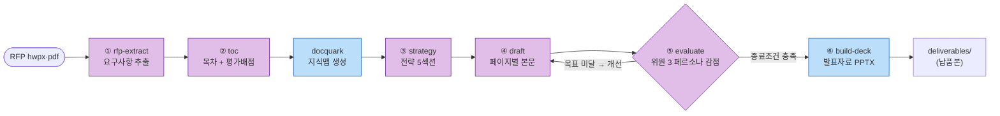
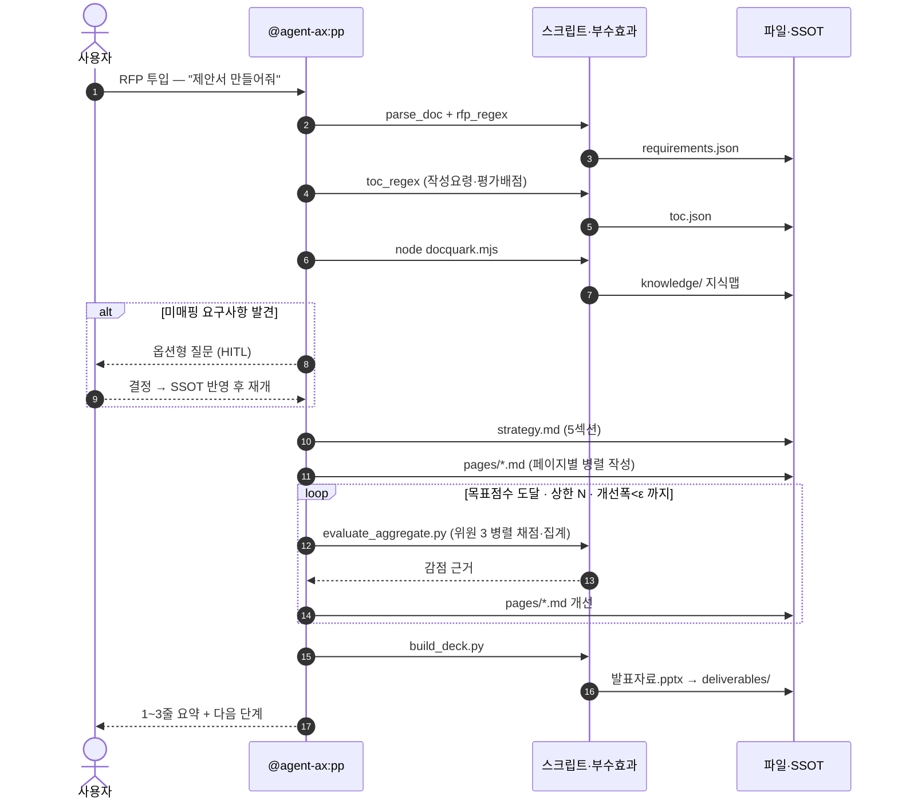
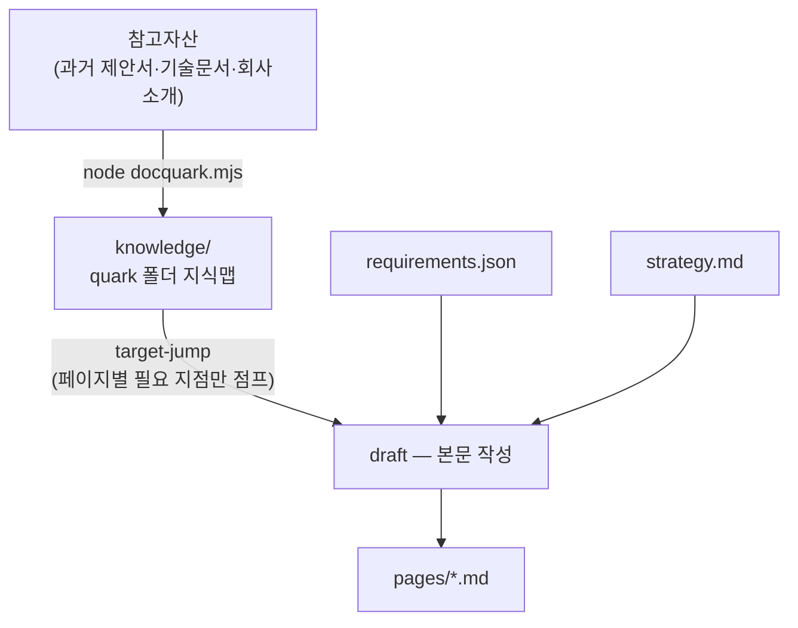
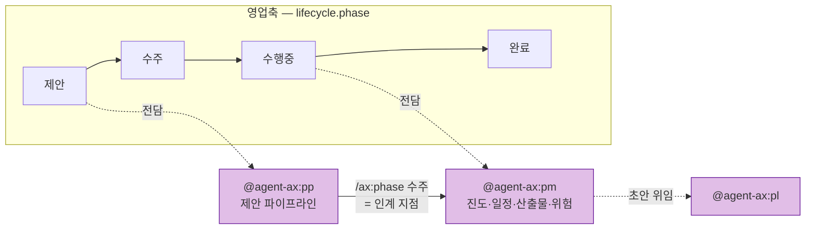

# ax 제안 파이프라인 가이드 — RFP → 발표자료 (v1.20.3)

> 작성자: 엔지니어링팀 · 버전: ax v1.20.3 (제안축 도입 v1.8.0) · 문의: 엔지니어링팀  
> 종합 안내는 **ax — 설치·운영·릴리즈 종합 안내**, 설치는 **ax 설치·합류 온보딩 가이드** 참고. 본 문서는 **제안축(제안 phase) 실무 절차**.

## 요약

- **제안축** = RFP 를 넣으면 요구사항 추출 → 목차 → 전략 → 본문 → 평가 → 발표자료까지 자동으로 굴러가는 6단계 파이프라인.
- 부르는 법은 **`@agent-ax:pp` 에 RFP 를 주는 것** 하나. "제안서 만들어줘"면 충분하고, 스킬·폴더·스키마는 몰라도 됨.
- 각 단계는 **구조화 SSOT 파일**을 남기고 다음 단계가 소비 — 중간에 끊겨도 그 파일부터 재개 가능.
- 결정이 필요한 지점(미매핑 요구사항·평가규정 미확인·모호한 담당)에서는 **에이전트가 먼저 물어봄**(HITL). 자율 ≠ 맹목.
- 영업축 전담 — 수주 후 수행 관리(진도·위험·산출물)는 `@agent-ax:pm` 으로 인계.

## 0. 파이프라인 한눈에



- 보라색 = **인지**(에이전트가 판단·작성) / 파란색 = **결정론**(스크립트가 기계적으로 처리).
- 이 분리는 원칙이다 — 파싱·지식맵·PPTX 빌드는 스크립트 엔트리포인트로만 돌고, 에이전트는 토큰을 만지지 않는다.

## 1. 단계별 입출력 (SSOT)

| # | 스킬 | 입력 | 출력 (SSOT) | 유형 |
|---|---|---|---|---|
| ① | `rfp-extract` | RFP(hwpx·pdf) | `proposal/requirements.json` — 요구사항 카드 | 인지 |
| ② | `toc` | RFP 작성요령·평가배점 + 확정 목차 | `proposal/toc.json` — 목차 트리 + 요구사항 매핑 + 담당사(R&R) + 배점 | 인지 |
| — | `docquark` | 참고자산 문서 | `knowledge/` 지식맵(quark 폴더) | 결정론 |
| ③ | `strategy` | requirements | `proposal/strategy.md` — 5섹션 전략·차별화 | 인지 |
| ④ | `draft` | toc + requirements + strategy + 지식맵 | `proposal/pages/{page_id}.md` — v3 propdraft | 인지 |
| ⑤ | `evaluate` | pages | 라운드별 감점 집계 + 개선 반복 | 인지 + 결정론 집계 |
| ⑥ | `build-deck` | pages + toc 순서 | `proposal/build/발표자료.pptx` → `deliverables/` | **부수효과(스크립트)** |

> 중간 산출은 `reference/drafts/00_영업_제안` 에, 고객 제출 최종본은 `deliverables/` 에 놓인다. "어디 저장?"은 물어보지 않는다 — 표준대로 배치된다.



## 2. 근거는 어디서 오나 — RAG 를 쓰지 않는 이유



- 임베딩·벡터DB(Qdrant 등) 의존을 **두지 않았다**. 자산을 quark 단위로 쪼갠 지식맵을 만들고, 페이지가 필요한 지점만 **target-jump** 로 가져온다.
- 이유는 환경 동질성 — GPU·검색서버 없이 **팀원 PC 에서 동일하게 구동**되어야 한다.
- 지식맵 생성 시 매핑되지 않은 요구사항은 `_UNMAPPED.md` 로 남고, 파이프라인은 그 지점에서 사용자에게 묻는다.

## 3. 평가·개선 반복 (⑤ evaluate)

- **평가위원 3 페르소나**로 채점: IT SI 20년+ · 응용SW 20년+ · 사업관리 20년+.
- **만점 기준 감점 누적** 방식. rubric 은 해당 RFP 의 **평가배점표**(기술/가격 세부배점)를 그대로 항목·가중으로 쓴다.
- 세 위원은 **병렬**로 채점하고, `evaluate_aggregate.py` 가 집계한다 — 점수 계산은 결정론, 개선 지시는 서술.
- **종료조건(무한루프 방지)**: `목표점수 도달` **OR** `라운드 상한 N` **OR** `개선폭 < ε`. 프로토타입이 구조적 한계로 멈춘 사례가 있어 상한을 반드시 둔다.

## 4. 자료를 던져만 놔도 — dispatch

- 드롭존(`inbox/`·Slack 채널)에 올라온 자료를 `dispatch` 가 **분류·신뢰도 판정**해 현재 phase 에 맞는 파이프라인으로 라우팅한다.
- 신뢰도가 낮거나 phase 와 어긋나면 **자동 실행하지 않고 질문**한다.
- 결정 필요 지점은 `hitl_scan.py` 가 6종 트리거로 결정론적으로 잡아낸다 — 사람이 물어봐 주길 기다리지 않는다.

## 5. 실행 전 점검

```bash
/ax:doctor      # §5.5 제안축 런타임 프리플라이트
```

| 런타임 | 용도 | 없을 때 |
|---|---|---|
| Node.js 18+ | `docquark.mjs` 지식맵 생성 | 지식맵 단계 실패 → 근거 없는 본문 |
| python-pptx | `build_deck.py` PPTX 빌드 | ⑥ 단계 실패 |
| PyYAML | 설정·데이터 파싱 | 파이프라인 초기화 실패 |
| lxml | hwpx XML 파싱 | hwpx RFP 파싱 실패(pdf 는 가능) |

> doctor 가 OS별 설치 명령까지 안내한다. 이 4종은 플러그인 전체의 "stdlib 무의존" 원칙에 대한 **명시적 분기**다(회의록 lxml 예외와 동류).

## 6. 역할 경계

| 에이전트 | 담당 | 쓰기 범위 |
|---|---|---|
| `@agent-ax:pp` | **제안 phase 전담** — 위 6단계 | `proposal/` · `knowledge/` · `reference/drafts/00_영업_제안` |
| `@agent-ax:pm` | 수행 phase 관리 — 진도·일정·산출물·위험, phase 전환, registry | 관리 문서 |
| `@agent-ax:pl` | 개별 산출물 초안 (제안서 외 표준 산출물 포함) | `reference/` |



- 수주하면 **제안축 → 수행축(revision) 인계**: `/ax:phase 수주` 로 단계를 넘기고 이후는 PM 이 잡는다.

## 약점·한계 (정직)

- **`evaluate` 점수는 실제 평가 결과가 아니다.** 평가위원 페르소나 기반 **감점 시뮬레이션**이며, 목표점수 도달이 수주를 보장하지 않는다. 사람 검토를 대체하지 말 것.
- **자산 규모 스케일 한계** — 근거를 파일 컨텍스트로 직접 주입하는 방식이라 참고자산이 크게 늘면 한계가 온다. 경량검색 도입 시점은 미확정.
- **파싱 품질은 원본 품질에 종속** — 스캔 PDF·표 중심 hwpx 는 추출 누락이 생길 수 있다. `requirements.json` 은 반드시 사람이 한 번 훑을 것.
- **반복 비용** — evaluate 라운드마다 위원 3 + 개선이 돌아 토큰 비용이 누적된다. 목표점수·상한 N 을 현실적으로 잡을 것.
- 본 문서는 v1.20.3 기준. 커맨드·스킬 구성은 다음 릴리즈 시 현행화 대상.

---

*출처: `plugin/ax/agents/pp.md` · `plugin/ax/skills/{rfp-extract,toc,strategy,draft,evaluate,build-deck,dispatch}` · `scripts/{docquark.mjs,evaluate_aggregate.py,build_deck.py,dispatch.py,hitl_scan.py}` · `docs/design/PROPOSAL_PIPELINE_DESIGN.md` · 원본 `docs/notion/proposal-pipeline-guide.md`*
